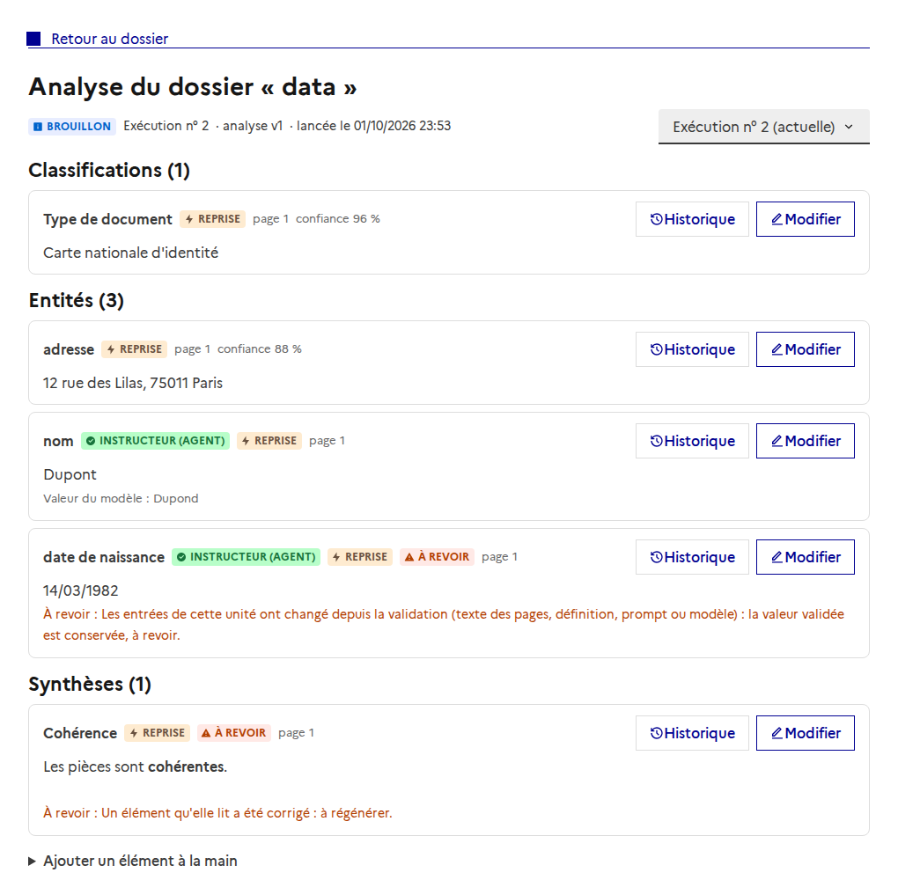

# Relance incrémentale de l'analyse de dossier

Issue : [#119](https://github.com/IA-Generative/dig-dig-doc/issues/119) (parent [#106](https://github.com/IA-Generative/dig-dig-doc/issues/106)). S'appuie sur les empreintes d'unités de [#126](https://github.com/IA-Generative/dig-dig-doc/issues/126).

## Principe

Relancer un dossier crée une **nouvelle analyse** (une par exécution) qui **ne recalcule que les unités dont les entrées ont changé** et **reprend telles quelles les autres**, apports des instructeurs compris. Il n'y a **aucun appariement** entre analyses : on compare des **empreintes d'unités**.

Pour chaque unité, le worker la déclare avec son empreinte ; le backend regarde si l'**analyse précédente** a une unité du même type, **terminée**, avec la même empreinte :

- **oui** : l'unité et **tous ses éléments, avec toutes leurs versions**, sont copiés dans la nouvelle analyse. **Aucun appel au LLM** (ni VLM). Une unité qui n'avait rien produit est reprise aussi.
- **non** : le worker la calcule normalement.

Deux unités identiques (deux pages au même texte) reprennent chacune une unité **distincte** de l'analyse précédente. Une unité en échec n'est jamais reprise.

## Ce qui est repris, et comment

| Cas | Comportement |
|---|---|
| **Unité inchangée** (classification d'une page, lot × groupe d'extraction) | copie de l'unité et de ses éléments ; la valeur du modèle devient « reprise » (résultat d'une exécution précédente) |
| **Valeur d'un instructeur** dans une unité reprise | reste **la sienne** (auteur, motif, date, zone corrigée conservés) et reste la version retenue |
| **Unité recalculée** (entrées modifiées) avec une valeur validée par un instructeur | la valeur validée est **conservée comme version retenue** et signalée **« à revoir »** avec son motif ; le nouveau résultat du modèle est produit **à côté**, rien n'est écrasé ; l'instructeur confirme ou corrige, ce qui efface le drapeau |
| **Unité recalculée**, sans apport d'instructeur | rien n'est conservé : le nouveau calcul la remplace |
| **Document supprimé** | ses unités ne sont pas reprises (elles restent visibles dans l'analyse précédente) |
| **Élément ajouté à la main** | repris à chaque relance |
| **Relation** | reprise avec ses extrémités **remplacées par leurs copies** ; **pas reprise** si une extrémité n'existe plus dans la nouvelle analyse |
| **Agent inchangé** (même configuration **et** mêmes unités amont) | sa **synthèse est reprise** sans appeler le LLM |
| **Agent dont une entrée a changé** | il tourne normalement : nouvelle synthèse |

Chaque copie garde un lien vers l'élément (`origin_element_id`) et la version (`origin_version_id`) d'origine. La prédiction source (`source_prediction_id`, unique) reste portée par l'élément d'origine.

L'analyse précédente n'est **jamais modifiée**.

## « À régénérer » (synthèses)

Une synthèse dépend des éléments qu'elle lit. Quand un instructeur **corrige** une classification, une entité ou un champ, les synthèses de l'analyse sont signalées **« à revoir : à régénérer »**. Elles ne sont **jamais régénérées automatiquement** : l'instructeur la confirme ou la corrige, ce qui efface le drapeau. Le drapeau est conservé quand la synthèse est reprise à la relance.

> **Limite à connaître :** les agents lisent les prédictions du dossier, pas encore l'analyse (donc pas les corrections des instructeurs) ; une synthèse « à régénérer » reprise telle quelle ne sera donc pas régénérée par une simple relance tant que ses entrées de pipeline sont inchangées.

## Moments où ça se passe

1. **Lancement** : la nouvelle analyse pointe vers la précédente (`previous_analysis_id`).
2. **Déclaration d'une unité** (`POST /api/internal/dossiers/{id}/analysis-units`) : reprise éventuelle ; la réponse indique `reused` et, pour l'extraction, les entités reprises (le worker en amorce la fusion des doublons entre lots).
3. **Fin de la classification ou de l'extraction** : valeurs validées des unités recalculées conservées « à revoir » ; quand **les deux** ont fini, reprise des éléments ajoutés à la main puis des relations.
4. **Avant un agent** (`POST /api/internal/dossiers/{id}/agent-units/reuse`) : le worker demande si la synthèse peut être reprise.

Le worker reste **tolérant** : si le backend n'a pas ces routes ou est en erreur, tout est calculé comme avant.

## Aperçu

Les éléments repris portent un badge **Reprise** ; une valeur d'instructeur conservée à côté d'une unité recalculée, ou une synthèse à régénérer, porte **À revoir** avec son motif.

## Ce qui n'est pas vérifié

- **Aucune relance réelle n'a été jouée** : les tests couvrent le backend (API interne réelle, base réelle) et le worker (backend simulé), mais pas un vrai dossier de bout en bout avec un vrai LLM (voir [#132](https://github.com/IA-Generative/dig-dig-doc/issues/132), scénarios C4 à C7).
- La capture ci-dessus utilise des **données simulées**.
- **Qualité de la reprise** : dépend de la stabilité des empreintes. Une empreinte instable (par exemple un texte de page légèrement différent à chaque extraction) empêcherait toute reprise ; à mesurer.

## Limites

- Les relations sont **perdues** si une de leurs extrémités est recalculée (sans apport d'instructeur) : l'extrémité n'a alors pas de copie.
- Une entité recalculée **qui diffère** laisse l'ancienne valeur validée « à revoir » **et** la nouvelle du modèle côte à côte : sans appariement, c'est l'instructeur qui tranche.
- Les analyses de rattrapage de la migration #120 (et les exécutions antérieures au suivi par unités) n'ont **ni unité ni empreinte** : rien n'en est repris comme unité. Leurs éléments issus du modèle **sans apport d'instructeur** ne sont pas conservés (le nouveau calcul les remplace) ; ceux **avec une valeur validée** sont conservés « à revoir » (on ne sait pas si leurs entrées ont changé).

## Code

- `backend/app/services/analysis_carryover.py` : reprise des unités, des apports, des éléments manuels et des relations.
- `backend/app/routers/internal.py` : réponse `reused` de la déclaration d'unité, reprise d'un agent.
- `backend/app/repositories/dossier_analysis_repository.py` : drapeau « à régénérer » ; `dossier_repository.py` : `previous_analysis_id` au lancement.
- `worker/agent_execution/app/api_client.py`, `tasks/classification.py`, `extraction.py`, `agent.py` : le worker ne calcule pas ce qui est repris.
- Tests : `backend/tests/test_analysis_relaunch.py`, `worker/agent_execution/tests/test_tasks.py`, `test_agent_task.py`.
