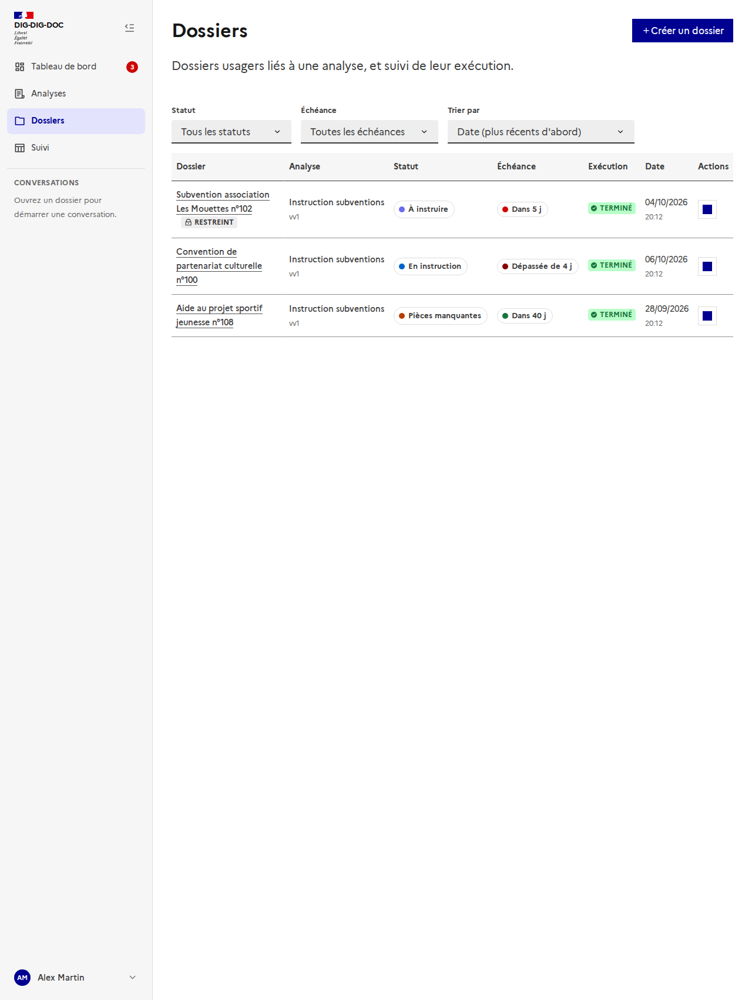
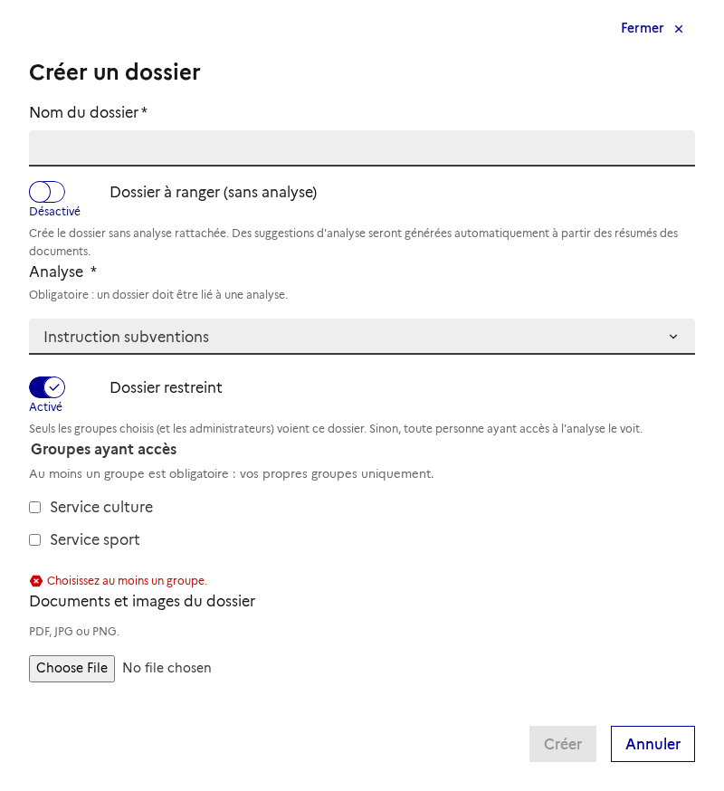
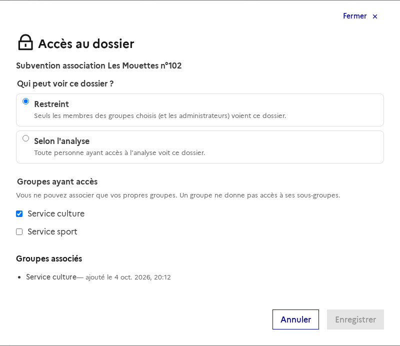
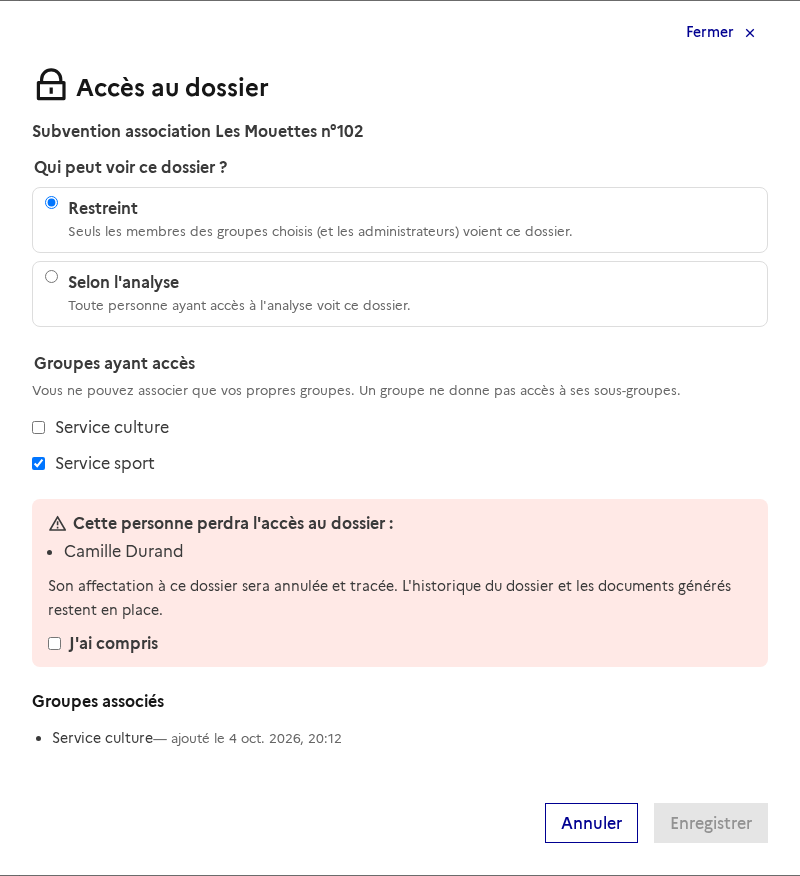
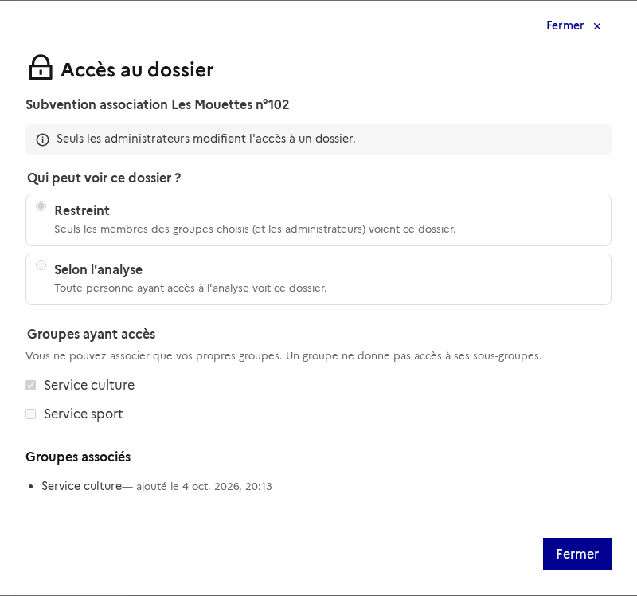
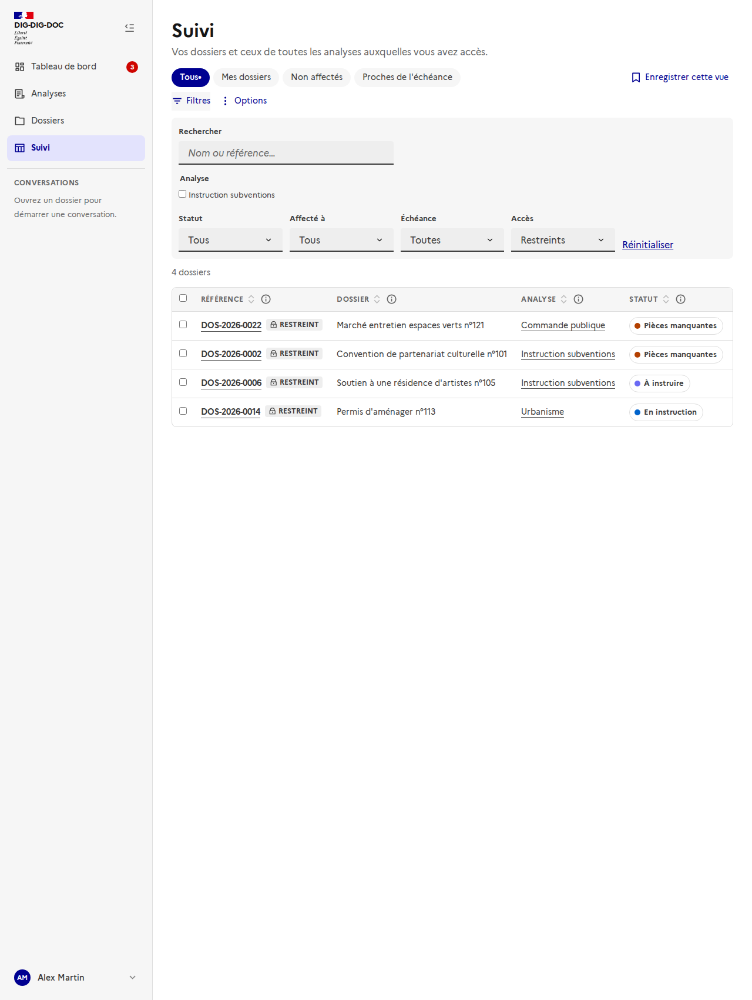
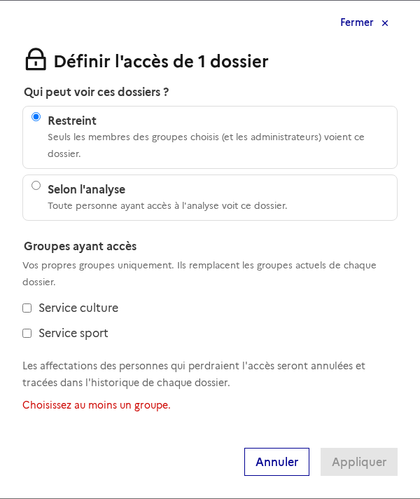
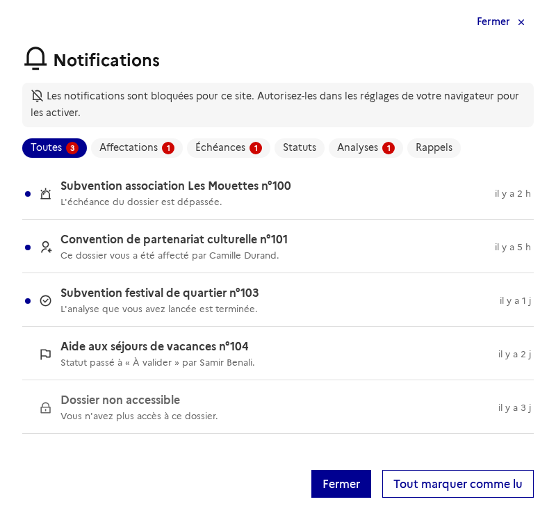

# Accès aux dossiers par groupe

Issue : [#177](https://github.com/IA-Generative/dig-dig-doc/issues/177) (parent [#167](https://github.com/IA-Generative/dig-dig-doc/issues/167)). Questions associées : [#178](https://github.com/IA-Generative/dig-dig-doc/issues/178) (rôles et permissions), [#179](https://github.com/IA-Generative/dig-dig-doc/issues/179) (prise en compte des changements de groupes), [#180](https://github.com/IA-Generative/dig-dig-doc/issues/180) (dossiers existants), [#181](https://github.com/IA-Generative/dig-dig-doc/issues/181) (dossier sans groupe actif), [#182](https://github.com/IA-Generative/dig-dig-doc/issues/182) (traces d'accès administrateur).

Avoir accès à une **analyse** ne doit pas donner accès à **tous ses dossiers** : un dossier peut être **restreint** à certains **groupes Keycloak**. Cette page décrit l'interface ; elle suit le tableau de bord et le [tableau de suivi](../tableau-de-suivi/README.md). La règle est appliquée **par le serveur** ([accès aux dossiers, backend](../../backend/acces-aux-dossiers.md), [accès de l'agent assistant](../../backend/acces-de-l-agent-assistant.md)) : l'interface la lit, l'explique et la modifie.

> **Branchée sur l'API.** Pastille, fenêtre « Accès », création, filtre et action en lot du suivi, notifications masquées : tout vient du serveur. Un dossier qu'on ne voit pas répond 404.

## Les règles

| Règle | Effet |
| --- | --- |
| **Restreint par défaut** | Un nouveau dossier n'est vu que des membres des groupes choisis et des administrateurs. |
| **Selon l'analyse** | Comportement actuel, conservé pour les dossiers existants : tout utilisateur ayant accès à l'analyse le voit. |
| **Mes groupes seulement** | On n'associe à un dossier que **ses propres groupes**, y compris un administrateur. |
| **Pas d'héritage** | Un groupe n'ouvre pas l'accès à ses sous-groupes ni à son groupe parent (le chemin exact est comparé). |
| **Les administrateurs** | Ils voient tout et sont **seuls à modifier** l'accès d'un dossier existant ; leur accès hors de leurs groupes sera tracé. |
| **Le créateur** | Il n'a **aucun droit propre** : son accès passe par ses groupes. Un dossier restreint a donc **au moins un groupe**. |
| **Affectation** | On n'affecte qu'une personne qui a accès au dossier ; si elle le perd, l'affectation est annulée. |
| **Dossiers existants** | Ils restent « Selon l'analyse », visibles comme avant, sans limite de temps ([#180](https://github.com/IA-Generative/dig-dig-doc/issues/180)). |

## Repérer un dossier restreint

La pastille **« Restreint »** (icône cadenas **et** libellé) figure à côté du nom du dossier dans la liste des dossiers, dans l'en-tête du dossier et dans le tableau de suivi. Rien n'est affiché pour un dossier « Selon l'analyse ».

## À la création

Dans « Créer un dossier », l'interrupteur **« Dossier restreint »** est activé par défaut. On coche parmi **ses** groupes (ceux de sa connexion) ceux qui auront accès ; **au moins un** est obligatoire (le bouton « Créer » reste inactif et un message l'explique, le serveur le refuse aussi). Si l'on n'a qu'un seul groupe, il est présélectionné ; sans aucun groupe, l'interface invite à en demander un à un administrateur. Désactiver l'interrupteur crée un dossier « Selon l'analyse ».

## La fenêtre « Accès au dossier »

Le **cadenas** de l'en-tête d'un dossier l'ouvre. Elle est chargée depuis le serveur et donne la **visibilité** (« Restreint » ou « Selon l'analyse », chacune avec son explication) et les **groupes ayant accès**. Un groupe associé dont on n'est pas membre reste affiché (« vous n'en êtes pas membre ») et peut être retiré par un administrateur. En bas, la liste des **groupes associés** indique depuis quand ; les changements d'accès eux-mêmes sont dans l'[historique du dossier](../historique-du-dossier/README.md) (« Accès modifié »).

### Perdre l'accès : la confirmation

Chaque modification lance une **simulation côté serveur** (`dry_run`, rien n'est enregistré ni tracé). Si la personne **affectée** au dossier perdrait l'accès, un encadré **la nomme**, rappelle que son **affectation sera annulée et tracée** et que l'**historique du dossier et ses documents générés restent en place**. Il faut cocher « J'ai compris » pour enregistrer. Un dossier restreint sans groupe ne s'enregistre pas.

Après l'enregistrement, le message confirme le changement (« Accès enregistré. Le changement est tracé dans l'historique du dossier. ») et indique l'affectation annulée le cas échéant. Une erreur du serveur (par exemple un groupe qui n'est pas le sien) s'affiche dans la fenêtre.

### Pour un non-administrateur

Les personnes qui ont accès au dossier voient ses règles, mais **ne peuvent rien modifier** : « Seuls les administrateurs modifient l'accès à un dossier ».

## Dans le tableau de suivi

- Le filtre **Accès** (restreints, selon l'analyse) et la pastille permettent de repérer les dossiers restreints.
- Un dossier **inaccessible** n'apparaît ni dans le tableau, ni dans les compteurs, ni dans l'export ; seul un administrateur le voit.
- L'**affectation** d'une personne qui n'a pas accès au dossier est refusée par le serveur (« Cette personne n'a pas accès à ce dossier »), unitaire ou en lot (tout ou rien).

Pour les administrateurs, « **Définir l'accès** » dans la barre de sélection applique une visibilité et des groupes à plusieurs dossiers **en une transaction** (tout ou rien) : les groupes **remplacent** ceux de chaque dossier, les affectations des personnes qui perdent l'accès sont annulées (le message en donne le nombre) et chaque dossier garde la trace dans son historique.

## Notifications d'un dossier devenu inaccessible

Quand l'accès est retiré, les notifications passées de la personne restent dans sa liste, mais **sans lien ni nom de dossier** (« Dossier non accessible »), pour ne rien révéler.

## Choix et limites

- **Le contrôle est côté serveur** : l'interface masque et explique, mais c'est la garde unique du serveur qui protège les données. Un dossier inaccessible répond **404**, pas 403.
- **Groupes** : ce sont ceux de la connexion de la personne (`groups` de son profil), sans appel à l'API d'administration de Keycloak. Un groupe modifié dans Keycloak n'est pris en compte qu'à la prochaine connexion ([#179](https://github.com/IA-Generative/dig-dig-doc/issues/179)).
- **Rôles** : la première version n'a qu'un niveau d'accès (voir le dossier ou non). Lecture seule, instruction, administration… seront définis dans Keycloak ([#178](https://github.com/IA-Generative/dig-dig-doc/issues/178)).
- **Dossiers existants** : ils restent « Selon l'analyse » à la mise en production ; seuls les dossiers créés ensuite sont restreints par défaut ([#180](https://github.com/IA-Generative/dig-dig-doc/issues/180)).
- **Pas encore** : un lien de partage par e-mail qui ne donnerait jamais plus de droits que ceux du destinataire ; l'état « restreint » annoncé par un lecteur d'écran est à vérifier (la pastille a un libellé, pas seulement une couleur).
- Pas de test automatisé côté interface ([#213](https://github.com/IA-Generative/dig-dig-doc/issues/213)) : l'écran est vérifié par ces captures, prises par `frontend/scripts/doc-screenshots.mjs` avec l'API interceptée (`node scripts/doc-screenshots.mjs <url> access`).
