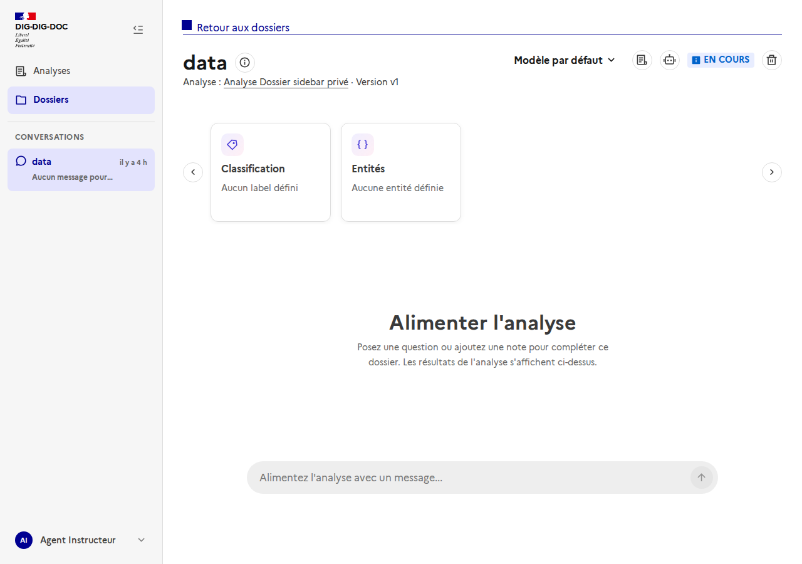
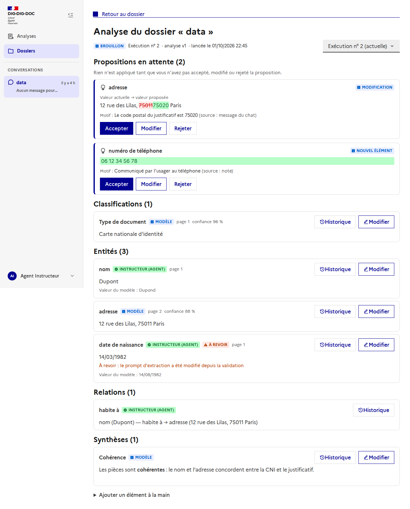
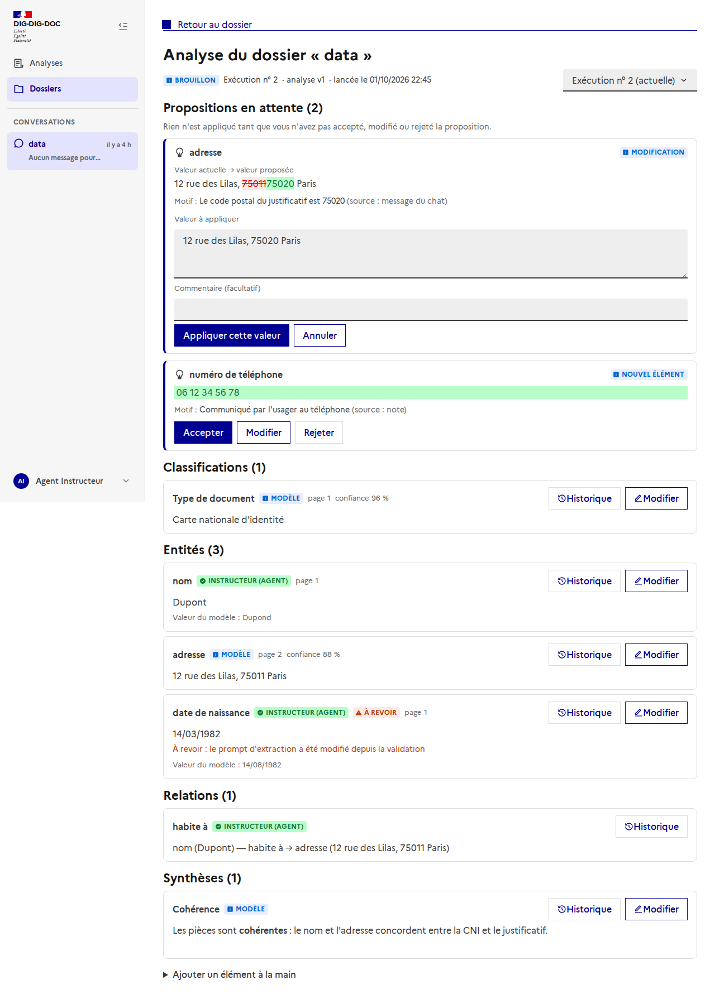
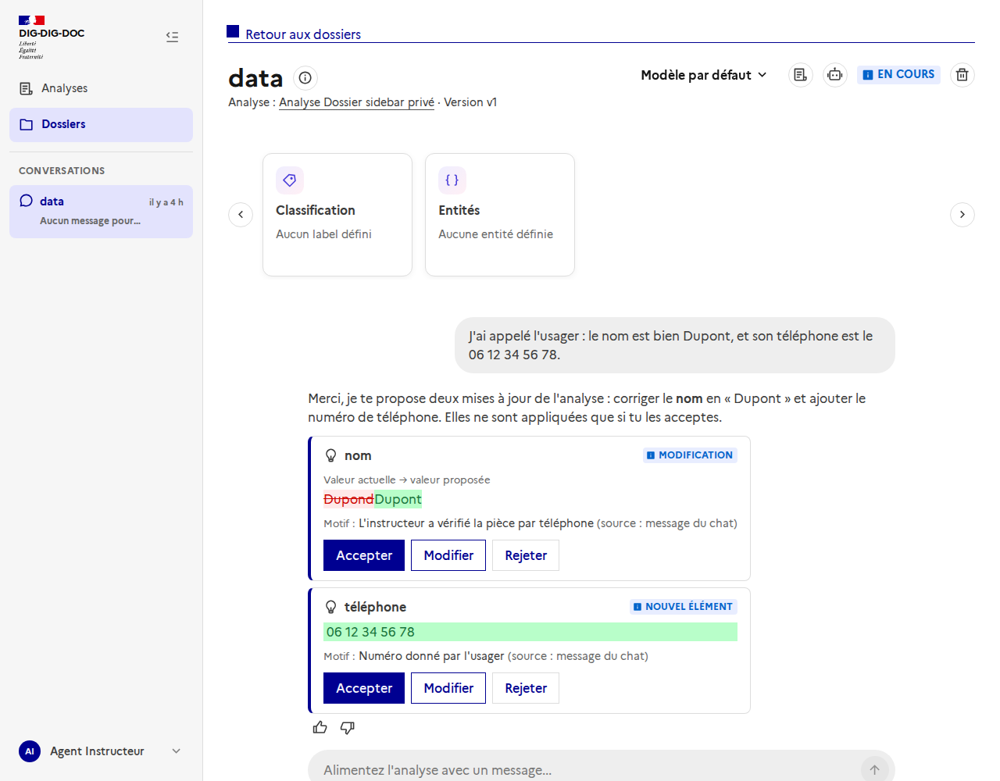
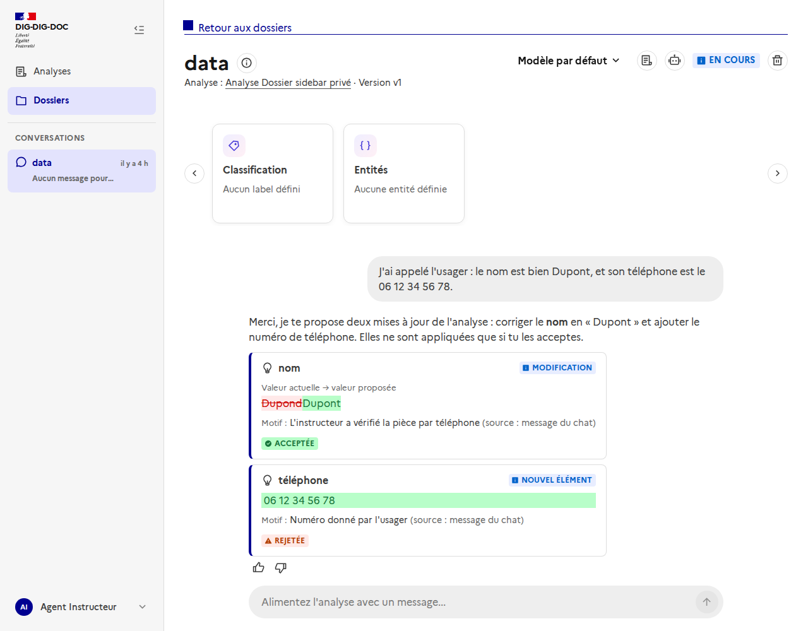
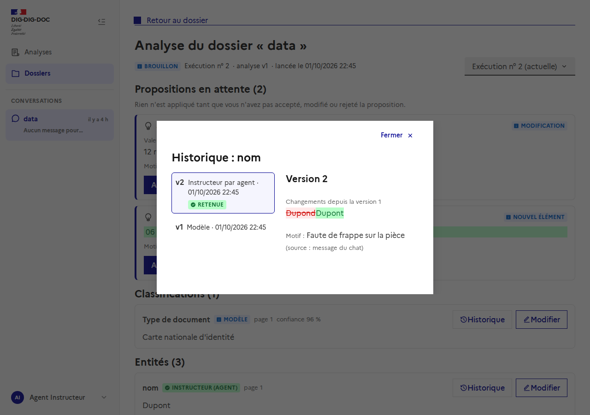

# Analyse de dossier : la vue de l'instructeur

Issue : [#116](https://github.com/IA-Generative/dig-dig-doc/issues/116) (parent [#106](https://github.com/IA-Generative/dig-dig-doc/issues/106)).

L'analyse de dossier est le document de travail d'un dossier : **une analyse par exécution**, faite d'éléments (classifications, entités, relations, synthèses, champs) qui ont chacun plusieurs versions. Cette page permet à l'instructeur de la **consulter**, de voir d'où vient chaque valeur, de **l'enrichir**, de **revenir à une version antérieure** et de traiter les **propositions de modification**. Elle est interne : elle n'est jamais montrée aux usagers.

## Y accéder

Dans l'en-tête d'un dossier, l'icône « liste » (à gauche de l'icône assistant) ouvre `/dossiers/<id>/analyse`.

## La vue

- **Exécution :** le sélecteur en haut à droite permet de consulter les exécutions précédentes. Seule l'analyse la plus récente est modifiable ; les autres sont en lecture seule, et une analyse **figée** ne se modifie plus.
- **Éléments** groupés par type. Chaque élément indique sa **provenance** : *Modèle*, *Instructeur* (avec l'auteur) ou *Reprise*, la page, la confiance du modèle, et la **valeur du modèle** quand un instructeur l'a remplacée (elle n'est jamais écrasée).
- **« À revoir »** : signale un élément validé dont les entrées ont changé (relance de l'analyse), avec le motif.
- **Modifier** apporte une nouvelle valeur ; le **motif est obligatoire**. Les relations ne s'éditent pas en texte (restauration seulement).
- **Ajouter un élément à la main** en bas de page.

## Propositions en attente

Une proposition (par exemple issue du chat ou d'une note) n'applique **rien** tant que l'utilisateur ne l'a pas traitée :
- **Accepter** : crée une version avec la valeur proposée ;
- **Modifier** : accepte avec une autre valeur ;
- **Rejeter** : n'applique rien.

La valeur actuelle et la valeur proposée sont comparées mot à mot. Si l'élément a été modifié entre-temps, le serveur refuse d'appliquer la proposition (elle peut être rejetée). Chaque décision est journalisée côté serveur (#114).

## Dans le chat du dossier

Issue : [#115](https://github.com/IA-Generative/dig-dig-doc/issues/115).

Quand l'instructeur apporte une information claire dans le chat (« j'ai appelé l'usager, le nom est bien Dupont »), le chat **propose** la modification de l'analyse. Les propositions s'affichent en cartes sous sa réponse, avec la même carte que dans la vue de l'analyse :

Elles ne sont appliquées que si l'utilisateur clique : **Accepter**, **Modifier** (autre valeur) ou **Rejeter**. La carte affiche ensuite le résultat.

Comment ça marche :
- Le chat dispose de deux outils, **seulement quand le dossier a une analyse** : `view_analysis` (liste des éléments et de leurs identifiants) et `propose_update` (dépose une proposition **en attente**, n'applique rien). Les appels sont visibles dans le chat comme les autres étapes d'outils.
- Le prompt demande une proposition par information clairement exprimée, jamais pour une simple question, et de ne jamais affirmer qu'une proposition est appliquée. Une réponse ne peut pas déposer plus de 5 propositions.
- Le worker ajoute à la réponse un commentaire HTML invisible `<!--analysis-proposals:<analyse>:<id>,<id>-->` ; le frontend le retire du texte et affiche les cartes (état réel lu côté serveur). C'est le worker, pas le LLM, qui l'ajoute.
- Chaque proposition enregistre l'utilisateur de la conversation, le message source, le **modèle** et la **version du prompt** (`chat-v2`) : c'est ce qui permettra de mesurer le taux d'acceptation (journal des décisions de #114, métriques #102).
- Le chat ne propose que sur l'analyse **courante du dossier ouvert**, et pas pour les relations (qui se saisissent dans la vue de l'analyse).

## Historique et restauration

Le bouton **Historique** liste toutes les versions d'un élément, avec ce qui a changé de l'une à l'autre. **Restaurer** une version en **ajoute** une nouvelle (rien n'est supprimé ni modifié).

## Code

- `frontend/src/pages/DossierAnalysisPage.vue` : la page ; route `dossier-analysis` dans `router/index.ts`.
- `frontend/src/composables/useDossierAnalysis.ts` : chargement et actions (modifier, restaurer, accepter, modifier ou rejeter une proposition).
- `frontend/src/components/analysis/ProposalCard.vue` : carte de proposition, partagée avec le chat.
- `frontend/src/components/analysis/ChatProposals.vue` : cartes sous une réponse du chat (#115).
- `frontend/src/utils/assistantSuggestion.ts` : lecture des marqueurs de réponse du chat.
- `worker/agent_execution/app/analysis_tools.py`, `tools.py`, `chat_graph.py` : outils `view_analysis` et `propose_update`, consigne du prompt, marqueur.
- `backend/app/routers/internal.py` : `GET /api/internal/dossiers/{id}/analysis` et `POST /api/internal/dossiers/{id}/analysis/proposals`.
- `frontend/src/components/analysis/ElementHistoryModal.vue` : historique et restauration.
- `frontend/src/types/dossierAnalysis.ts`, `frontend/src/utils/textDiff.ts` : types, textes de valeurs, différence mot à mot.
- API utilisée : routes `/api/dossiers/{id}/analyses-dossier/...` (#112, #114).

## À propos des captures

Les images montrent l'interface réelle sur la stack de dev, mais **les données de l'analyse sont simulées** (réponses de l'API interceptées par le script de capture) : le backend en cours d'exécution sur cette stack tournait sur une image antérieure, sans ces routes. Le comportement avec un vrai backend n'a donc pas été vu dans le navigateur. Les captures du chat (propositions) sont aussi simulées : réponse du chat avec le marqueur et routes des propositions interceptées ; **aucun vrai LLM n'a appelé l'outil**. Le script de capture n'est pas versionné ; pour les régénérer, lancer la stack à jour, créer une analyse via l'API, puis capturer `/dossiers/<id>/analyse`.
