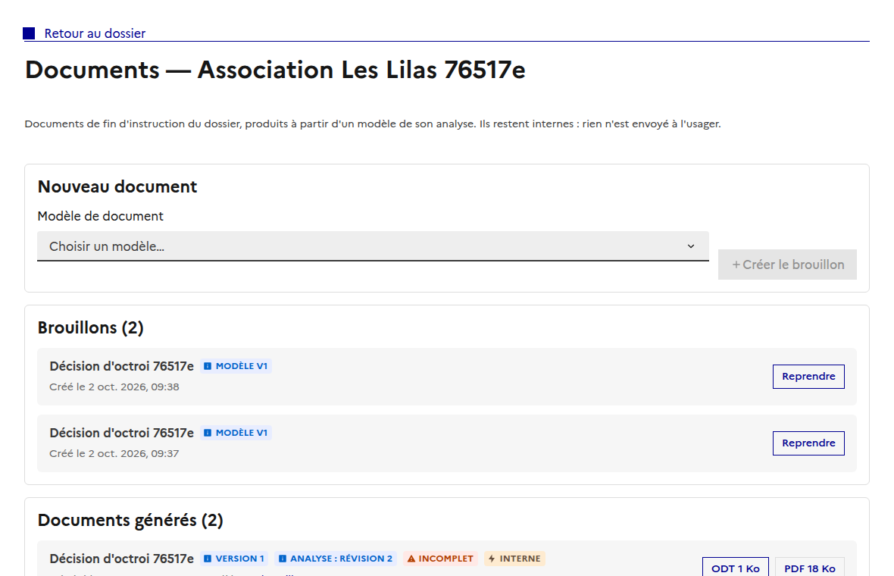
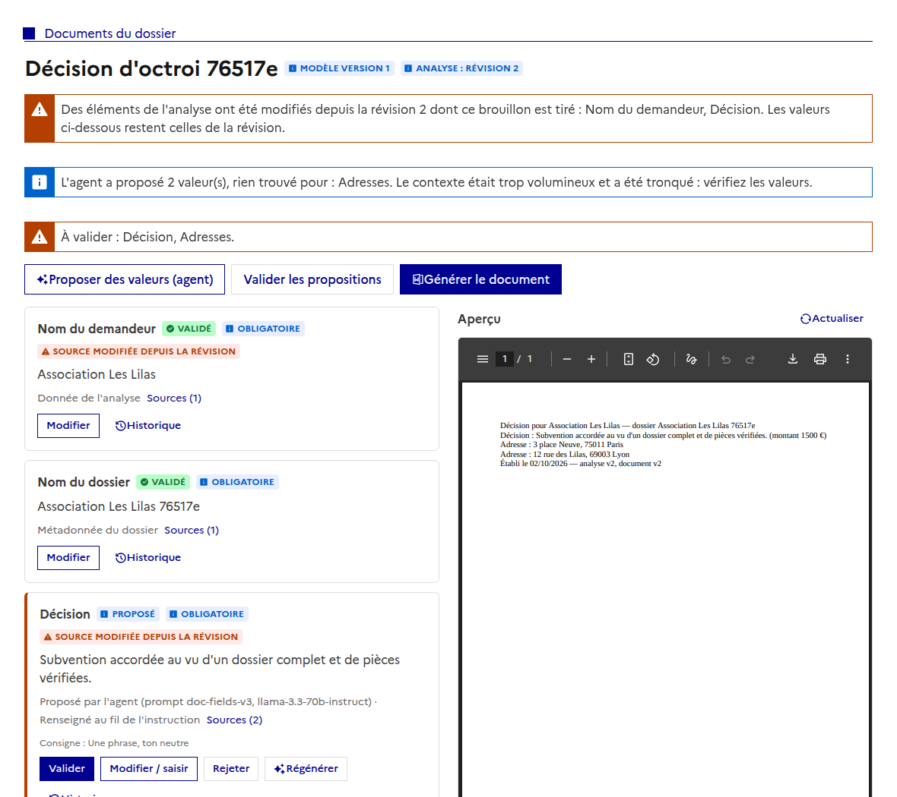
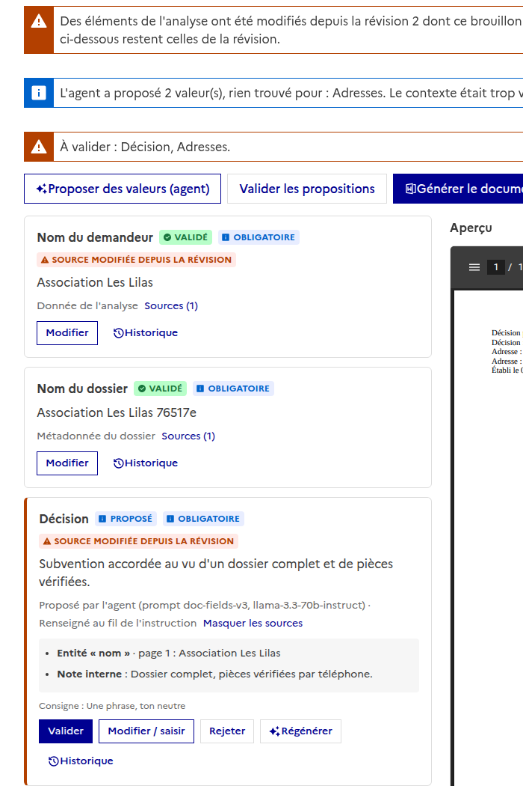
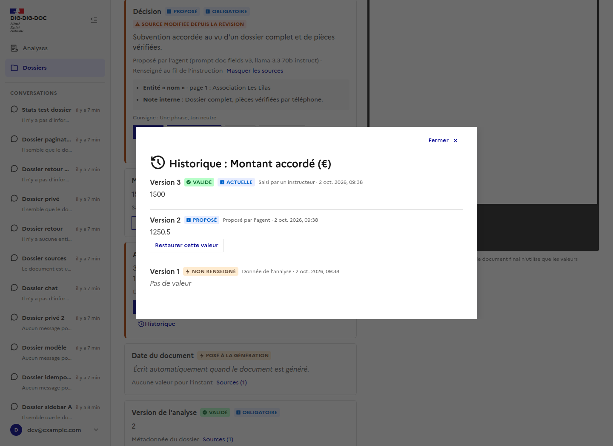
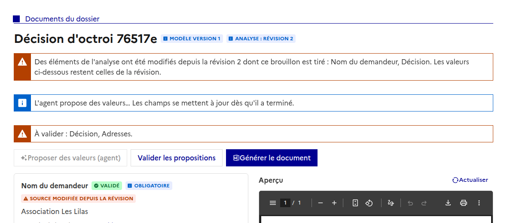
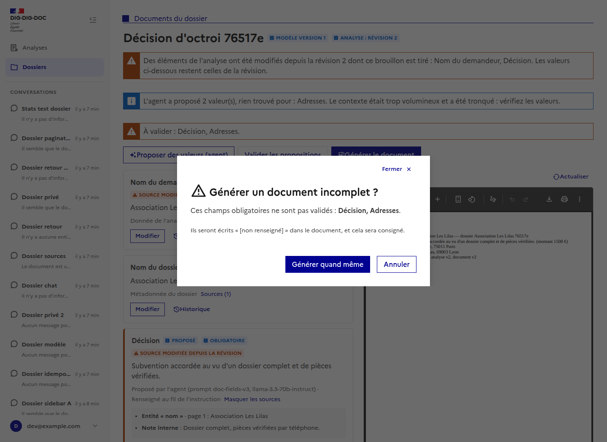
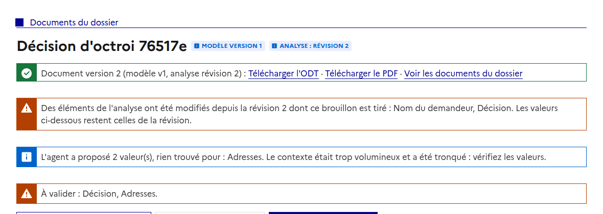

# Documents d'un dossier : brouillon, revue et génération

Issue : [#142](https://github.com/IA-Generative/mille-feuille/issues/142) (parent [#107](https://github.com/IA-Generative/mille-feuille/issues/107)). API : [`brouillons-de-document`](../../backend/brouillons-de-document.md), [`generation-des-champs`](../../backend/generation-des-champs.md), [`assemblage-des-documents`](../../backend/assemblage-des-documents.md). Les modèles se gèrent dans l'onglet « Documents » de l'analyse ([`modeles-de-document`](../modeles-de-document/README.md)).

Un **document de fin d'instruction** se prépare en trois temps : un **brouillon** (un modèle de l'analyse du dossier), la **revue** de ses champs (valeur, statut, sources, aperçu fidèle), puis la **génération** du fichier (ODT et PDF). Tout est **interne** : rien n'est envoyé à l'usager.

## Y accéder

Dans l'en-tête d'un dossier, l'icône « document Word » (à côté de celle de l'analyse) ouvre `/dossiers/<id>/documents`.

## La liste des documents du dossier

- **Nouveau document** : on choisit un modèle parmi ceux **de l'analyse du dossier** (non archivés) et « Créer le brouillon ». Le brouillon fige une **révision de l'analyse** : les valeurs de départ viennent d'elle, et l'analyse peut évoluer ensuite sans changer le brouillon.
- **Brouillons** : on les reprend (un dossier peut en avoir plusieurs).
- **Documents générés** : version du document, révision de l'analyse source, **Incomplet** si des champs obligatoires n'étaient pas validés, visibilité (**interne**), et le **téléchargement de l'ODT** (à retoucher hors de l'application) et du **PDF**.

## La revue d'un brouillon

À gauche, **tous les champs du modèle**, chacun avec sa valeur, son statut et son origine ; à droite, l'**aperçu fidèle** du document.

- **Statut** : *non renseigné*, *proposé*, *validé*. Un champ **obligatoire** pas encore validé est mis en évidence (liseré orange), et le bandeau de complétude dit lesquels sont « à renseigner » ou « à valider ».
- **Origine** : donnée de l'analyse, **proposé par l'agent** (avec la version du prompt et le modèle), ou saisi par un instructeur.
- **Posé à la génération** : la date du document et son numéro de version s'écrivent à la génération ; il n'y a rien à relire.
- **Version de l'analyse** : l'en-tête dit à quelle **révision** le brouillon est lié. Si des éléments de l'analyse ont été **modifiés depuis**, un bandeau et le badge « Source modifiée depuis la révision » le signalent, champ par champ ; le brouillon **garde** les valeurs de sa révision.

### Les sources d'une valeur

« Sources » déroule **d'où vient la valeur**, lisiblement : l'élément de l'analyse (type, nom, page, texte), la note interne, ou la métadonnée du dossier.

### Ce qu'on peut faire d'un champ

| Action | Effet |
| --- | --- |
| **Valider** | Accepte la valeur proposée telle quelle. |
| **Modifier / saisir** | Saisie à la main, **validée d'office**, avec un motif facultatif. La saisie suit le type : texte, date, nombre, oui/non, liste (un élément par ligne). |
| **Rejeter** | Écarte la proposition ; le champ redevient non renseigné. |
| **Régénérer** | Demande à l'agent une nouvelle valeur **pour ce champ seul**, avec une consigne facultative (« plus court »). Indisponible pour un champ **validé** : une valeur validée n'est jamais réécrite automatiquement, elle ne change qu'à la main. |
| **Historique** | Toutes les versions du champ, de la plus récente à la plus ancienne ; **Restaurer** ajoute une version (rien n'est écrasé). |

### L'agent

« **Proposer des valeurs (agent)** » lui fait proposer une valeur pour chaque champ non validé ; « **Valider les propositions** » les accepte d'un coup.

Pendant qu'il travaille, un bandeau l'indique et la relance est indisponible ; l'écran se met à jour tout seul à la fin et donne le **bilan** : nombre de valeurs proposées, **champs pour lesquels il n'a rien trouvé** (jamais inventé), et si le **contexte a été tronqué** (à vérifier).

### L'aperçu

L'aperçu est le **PDF du modèle rempli avec les valeurs courantes**, par le même moteur (LibreOffice) que le document final : la mise en page est conservée. Il n'est **pas éditable** : on modifie les valeurs des champs et l'aperçu suit, **après une courte pause** (0,7 s) suivant la dernière modification, ou au clic sur « Actualiser ». Le serveur le **met en cache** sur les valeurs : un aperçu déjà calculé pour les mêmes valeurs n'est pas recalculé. Les valeurs seulement **proposées** y figurent (pour voir le document tel qu'il serait) ; le document final, lui, n'utilise que les **validées**.

## Générer le document

« **Générer le document** » assemble l'ODT et le PDF à partir des valeurs **validées**. Si des champs obligatoires ne le sont pas, une **confirmation explicite** liste ces champs : « Générer quand même » les écrit « [non renseigné] » dans le document et le consigne (badge **Incomplet** dans la liste). Une fois généré, l'encart donne les téléchargements ; chaque génération ajoute une **version**, les précédentes restent intactes.

## Choix et limites

- **Où se lance la revue** : une page dédiée aux documents du dossier (pas dans la page de l'analyse du dossier).
- **Pas de verrou ni de présence** quand plusieurs instructeurs relisent un même brouillon (décision de #140) : la dernière saisie gagne, chaque version est conservée dans l'historique.
- L'aperçu s'affiche avec le **visionneur PDF du navigateur** : sur un navigateur sans visionneur (certains mobiles), il ne s'affiche pas.
- Le suivi de l'agent se fait par **relecture toutes les 2 secondes** tant qu'il travaille (pas de flux en direct).
- Les captures sont prises avec le **vrai backend et le vrai worker de rendu** ; les propositions de l'agent y ont été déposées par le même chemin que le worker, **sans appel à un vrai LLM** (aucune clé dans l'environnement) : la qualité des propositions n'est pas évaluée.
