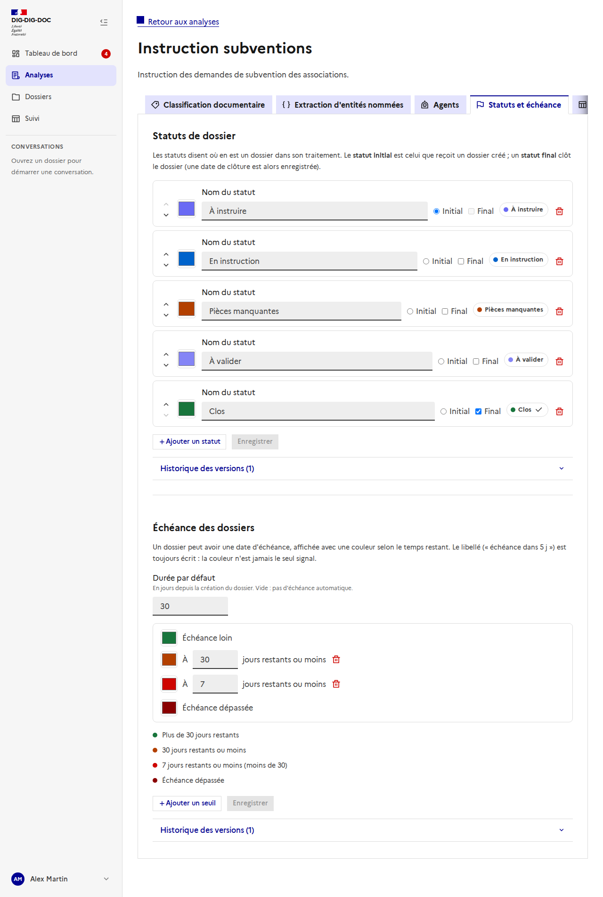
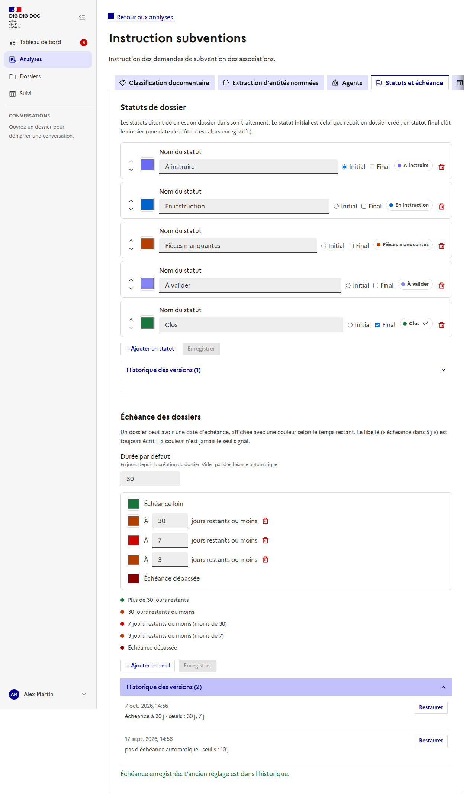
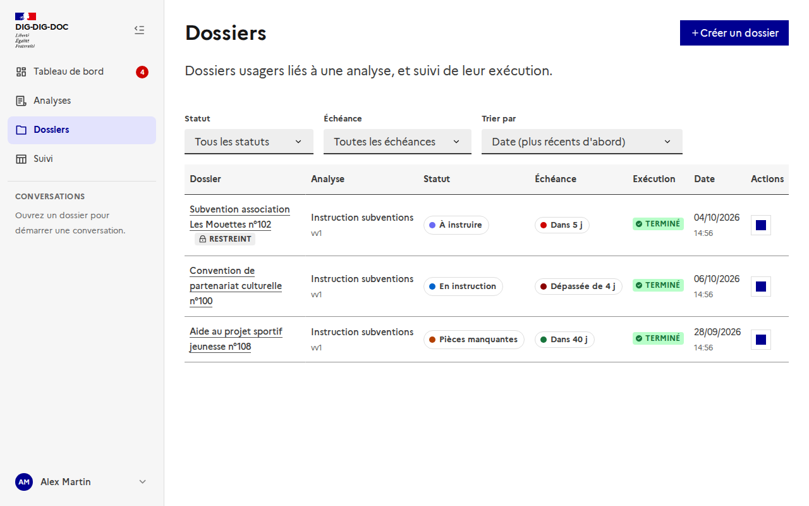
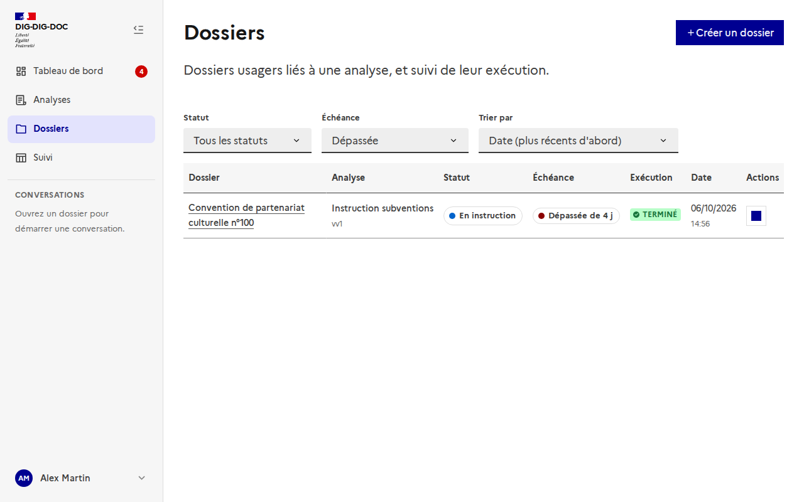
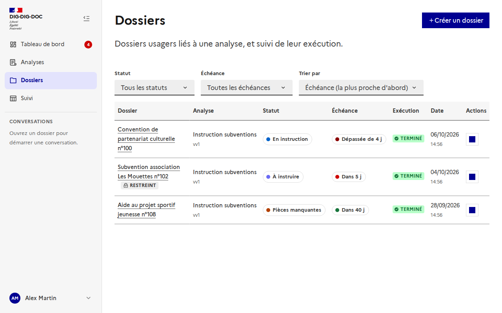
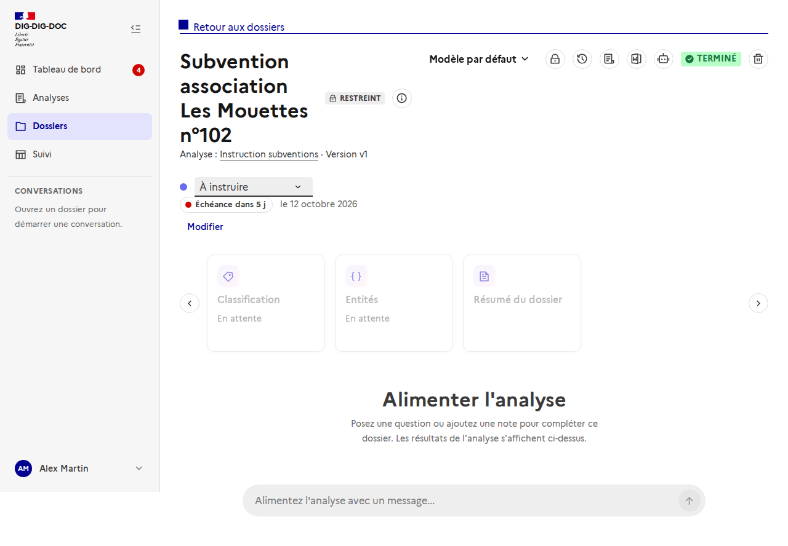
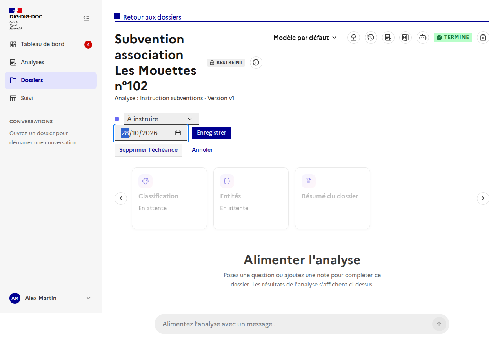
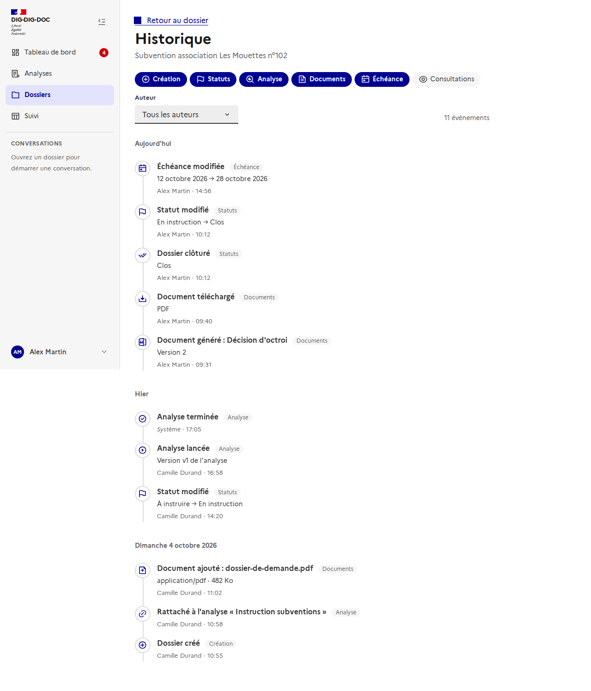

# Échéance du dossier

Issue : [#172](https://github.com/IA-Generative/mille-feuille/issues/172) (parent [#167](https://github.com/IA-Generative/mille-feuille/issues/167)). API : [`echeance-du-dossier`](../../backend/echeance-du-dossier.md).

Un dossier peut avoir une **date d'échéance**, affichée avec une **couleur** qui dépend du temps restant. Les seuils de couleur se règlent **par analyse**. Le libellé (« Échéance dans 5 j », « Échéance dépassée depuis 4 j ») est **toujours écrit** : la couleur n'est jamais le seul signal.

## Régler l'échéance d'une analyse

Dans une analyse, l'onglet **« Statuts et échéance »** a une section **Échéance des dossiers**.

- **Durée par défaut** : nombre de jours depuis la création du dossier. Vide : pas d'échéance automatique. Elle s'applique aux nouveaux dossiers et aux dossiers rattachés à l'analyse ensuite, pas aux dossiers existants.
- **Couleurs** : la couleur d'une échéance **loin**, un ou plusieurs **seuils** (« à 7 jours restants ou moins »), et la couleur d'une échéance **dépassée**. On ajoute jusqu'à 5 seuils. Un **aperçu** liste les niveaux obtenus.
- Les erreurs (jours hors de 1 à 3 650, deux seuils identiques) s'affichent avant l'enregistrement.

### Historique et restauration

Chaque enregistrement conserve l'état précédent. « Historique des versions » le liste, avec **Restaurer** ; l'état courant devient alors lui-même une version.

## Dans la liste des dossiers

La colonne **Échéance** montre la pastille colorée et un libellé court (« Dans 5 j », « Dépassée de 4 j »). Un dossier **clos** n'a plus de couleur (« Dossier clos »), un dossier sans échéance affiche « — ».

- Le filtre **Échéance** : dépassée, dans 7 jours ou moins, dans 30 jours ou moins, sans échéance. Il ne garde que les dossiers **non clos**.

- Le tri **Échéance (la plus proche d'abord)** met les dossiers sans échéance en dernier.

## Dans un dossier

Sous le statut, la pastille et la date (« le 12 octobre 2026 »). **Modifier** (ou **Définir une échéance**) ouvre un champ date.

On peut **enregistrer**, **supprimer l'échéance** ou **annuler**. Le niveau et la couleur sont recalculés par le serveur.

## Dans l'historique

Chaque changement est tracé dans l'[historique du dossier](../historique-du-dossier/README.md), catégorie **Échéance** : ancienne et nouvelle date, auteur et heure.

## Choix et limites

- **Seuils par analyse**, pas par utilisateur : une échéance est une règle de traitement.
- **Vocabulaire** : « échéance » partout.
- Un dossier **à ranger** (sans analyse) n'a pas de sélecteur d'échéance : il en recevra une, par la durée par défaut, une fois rattaché.
- Le **tableau de suivi** et le **tableau de bord** utilisent encore des données simulées avec des seuils de démonstration ; ils consommeront le niveau d'échéance du serveur quand ils seront branchés sur l'API.
- Aucune action à l'échéance (archivage, notification) : hors périmètre.
- Pas de test automatisé côté interface (le projet n'a pas encore de cadre de test frontend) : la page est vérifiée par la documentation et ses captures, générées par `frontend/scripts/doc-screenshots.mjs` avec l'API interceptée (`node scripts/doc-screenshots.mjs <url> due`).
