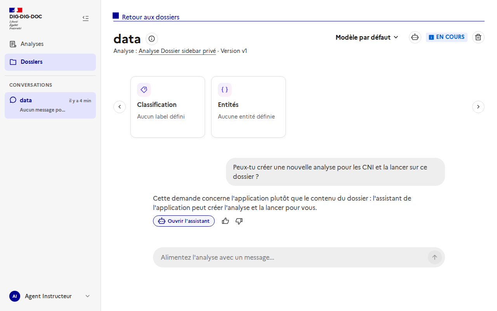
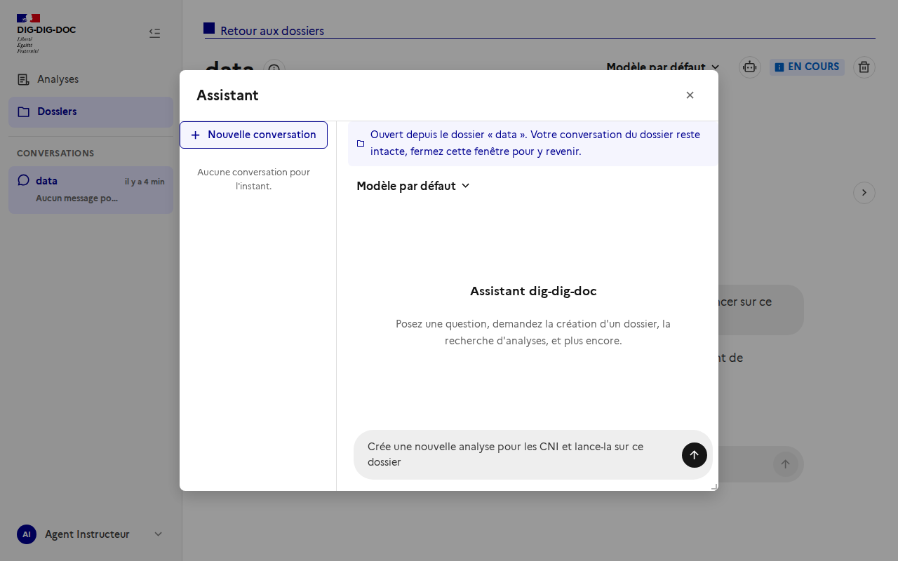

# Accès à l'assistant depuis le chat d'un dossier

Issue : [#104](https://github.com/IA-Generative/dig-dig-doc/issues/104)

Le chat d'un dossier sert à **analyser le contenu du dossier**. Pour **créer ou piloter** des analyses et des dossiers, l'utilisateur passe par l'**assistant** (agent helper), qui garde sa propre conversation. Les deux restent séparés : on ajoute seulement un accès direct de l'un vers l'autre.

## Fonctionnement

1. Dans l'en-tête d'un dossier, l'icône « robot » (à gauche du statut) ouvre l'assistant.

   

2. La modale de l'assistant s'ouvre avec un bandeau « Ouvert depuis le dossier « … » ». Le premier message envoyé est préfixé par la référence du dossier (nom et identifiant), pour que l'assistant sache de quel dossier on parle. Seule cette référence est transmise, jamais le contenu du dossier.

   

3. **Proposition automatique.** Quand une demande de l'utilisateur concerne l'application (créer ou configurer une analyse, créer ou lancer un dossier, retrouver des analyses) plutôt que le contenu du dossier, le chat du dossier explique brièvement que l'assistant peut s'en charger et affiche un bouton « Ouvrir l'assistant » sous sa réponse.

   

4. **Question pré-remplie.** Le clic ouvre la modale avec la demande de l'utilisateur, reformulée par le chat, déjà dans la zone de saisie : il n'a qu'à l'envoyer ou la modifier.

   

5. Fermer la modale ramène au chat du dossier, dont la conversation est intacte. Aucune réponse de l'assistant n'est ajoutée à la conversation du dossier.

L'assistant reste aussi accessible comme avant, depuis le menu utilisateur et le raccourci Ctrl+K (sans dossier de départ).

## Fonctionnement technique de la proposition

- Le chat du dossier dispose d'un outil `suggest_assistant(question)` (`worker/agent_execution/app/tools.py`), décrit au LLM comme à utiliser pour les demandes qui concernent l'application. Il n'a **aucun effet de bord** : il mémorise seulement la question.
- En fin d'exécution, le worker (`chat_graph.py`) ajoute à la réponse un commentaire HTML `<!--assistant-suggestion:<question encodée>-->`. C'est le worker, pas le LLM, qui l'ajoute, pour que le format soit fiable ; le marqueur est enregistré avec le message, donc le bouton reste affiché au rechargement.
- Le frontend (`utils/assistantSuggestion.ts`) retire le marqueur du texte affiché et, s'il existe, montre le bouton.
- Seule l'action de l'utilisateur ouvre l'assistant ; l'assistant garde ses propres confirmations pour toute action à effet de bord.

## Code

- `worker/agent_execution/app/tools.py`, `chat_graph.py` : outil `suggest_assistant`, consigne du prompt et marqueur.
- `frontend/src/utils/assistantSuggestion.ts` : lecture du marqueur.
- `frontend/src/composables/useHelperAgent.ts` : état partagé de la modale (ouverture, dossier de départ).
- `frontend/src/components/HelperAgentModal.vue` : bandeau de contexte et préfixe du premier message.
- `frontend/src/pages/DossierDetailPage.vue` : bouton d'accès dans l'en-tête.
- `frontend/src/components/UserMenu.vue` : utilise le même état partagé.

## Pas encore fait

- Mesure de la pertinence de la détection (fausses propositions, demandes manquées) : elle dépend du prompt et du modèle utilisés.

## Régénérer les captures

Les deux premières captures viennent de l'application en marche. Pour la proposition (3 et 4), le message de l'assistant a été simulé en interceptant la réponse de l'API des messages, car le worker n'était pas disponible en local : le rendu est réel, mais la détection par le LLM n'y est pas démontrée.

Avec la stack de dev lancée (`docker compose up`), connexion avec le compte de dev local du realm Keycloak, puis capture de `/dossiers/<id>` avant et après un clic sur le bouton « Ouvrir l'assistant de l'application ».
