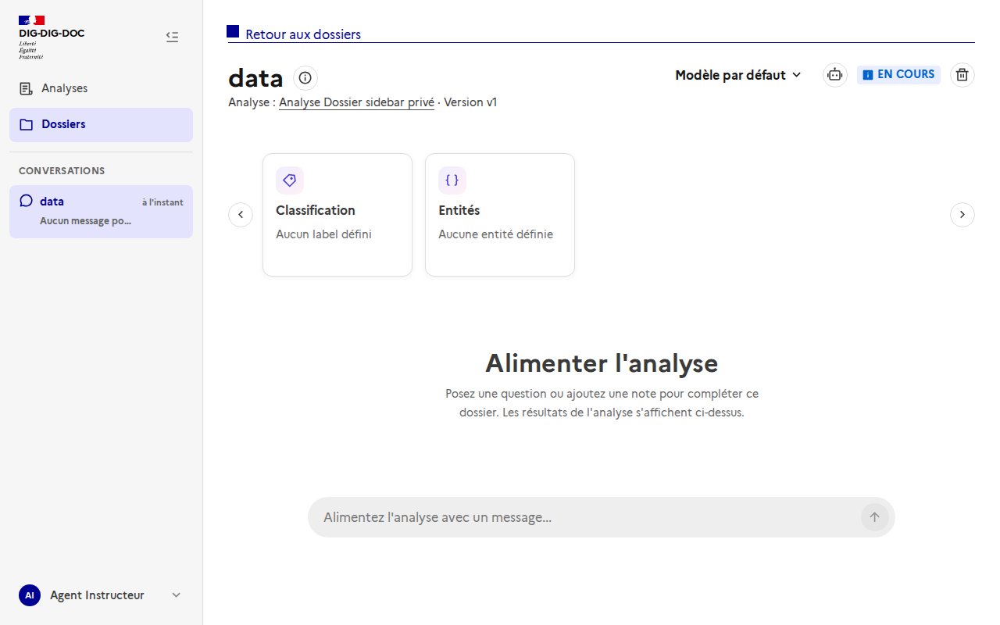
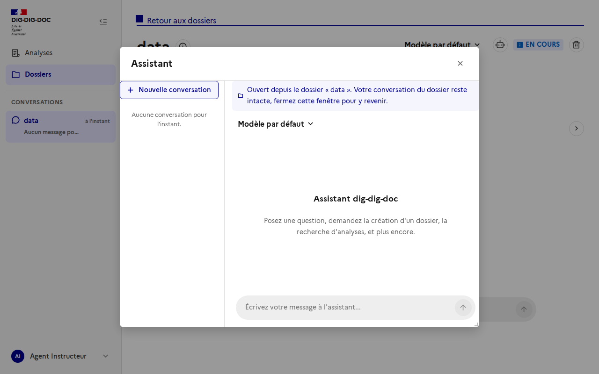

# Accès à l'assistant depuis le chat d'un dossier

Issue : [#104](https://github.com/IA-Generative/dig-dig-doc/issues/104)

Le chat d'un dossier sert à **analyser le contenu du dossier**. Pour **créer ou piloter** des analyses et des dossiers, l'utilisateur passe par l'**assistant** (agent helper), qui garde sa propre conversation. Les deux restent séparés : on ajoute seulement un accès direct de l'un vers l'autre.

## Fonctionnement

1. Dans l'en-tête d'un dossier, l'icône « robot » (à gauche du statut) ouvre l'assistant.

   

2. La modale de l'assistant s'ouvre avec un bandeau « Ouvert depuis le dossier « … » ». Le premier message envoyé est préfixé par la référence du dossier (nom et identifiant), pour que l'assistant sache de quel dossier on parle. Seule cette référence est transmise, jamais le contenu du dossier.

   

3. Fermer la modale ramène au chat du dossier, dont la conversation est intacte. Aucune réponse de l'assistant n'est ajoutée à la conversation du dossier.

L'assistant reste aussi accessible comme avant, depuis le menu utilisateur et le raccourci Ctrl+K (sans dossier de départ).

## Code

- `frontend/src/composables/useHelperAgent.ts` : état partagé de la modale (ouverture, dossier de départ).
- `frontend/src/components/HelperAgentModal.vue` : bandeau de contexte et préfixe du premier message.
- `frontend/src/pages/DossierDetailPage.vue` : bouton d'accès dans l'en-tête.
- `frontend/src/components/UserMenu.vue` : utilise le même état partagé.

## Pas encore fait

- Proposition automatique d'ouvrir l'assistant quand le chat du dossier détecte une demande qui concerne l'application.
- Question pré-remplie dans la modale.

## Régénérer les captures

Avec la stack de dev lancée (`docker compose up`), connexion avec le compte de dev local du realm Keycloak, puis capture de `/dossiers/<id>` avant et après un clic sur le bouton « Ouvrir l'assistant de l'application ».
