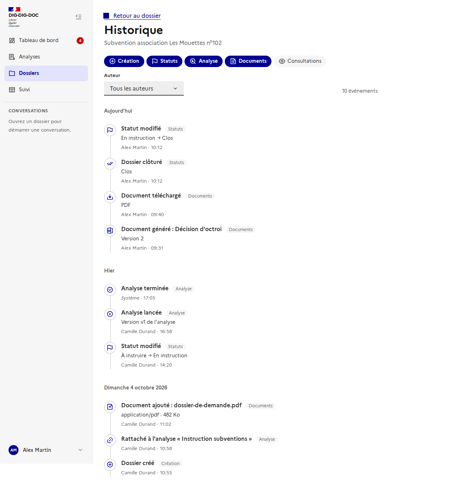
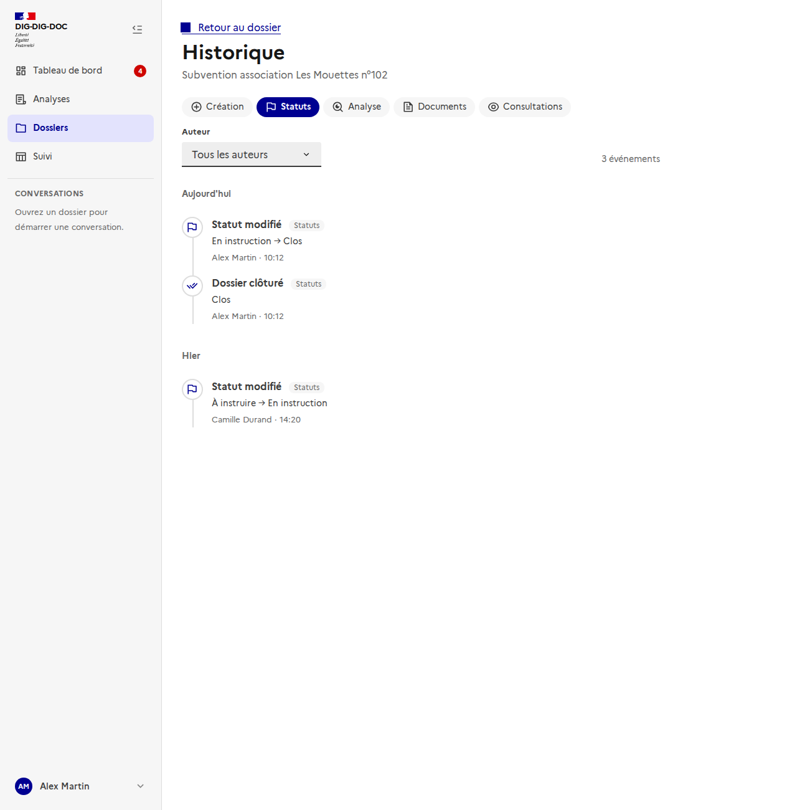
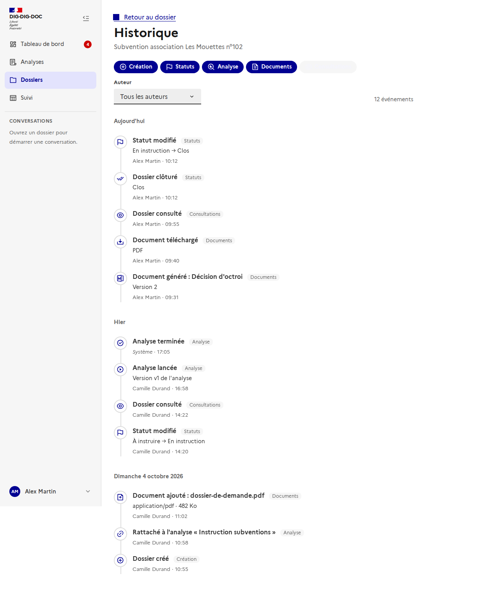
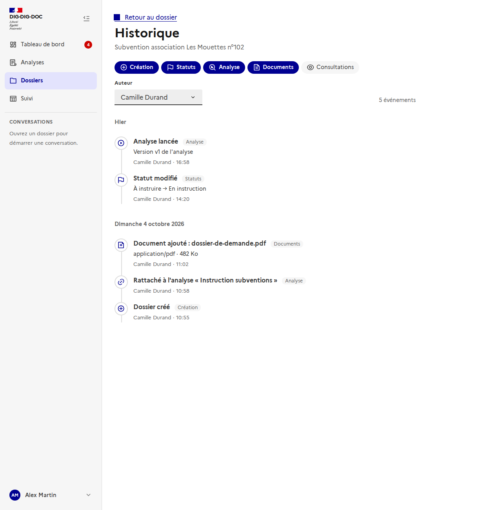

# Historique du dossier

Issue : [#171](https://github.com/IA-Generative/dig-dig-doc/issues/171) (parent [#167](https://github.com/IA-Generative/dig-dig-doc/issues/167)). API : [`journal-du-dossier`](../../backend/journal-du-dossier.md).

L'**historique** d'un dossier est la **chronologie de son journal d'événements** : qui a fait quoi, et quand. Il se lit du plus récent au plus ancien, se filtre par type et par auteur, et se pagine.

## Y accéder

Dans l'en-tête d'un dossier, l'icône **« historique »** (une horloge fléchée, avant celles de l'analyse et des documents) ouvre `/dossiers/<id>/historique`. Le lien **« Retour au dossier »** revient à la vue du dossier.

## La chronologie

Les événements sont **groupés par jour** (« Aujourd'hui », « Hier », puis la date). Chacun donne :

- une **icône** et un **titre** en français (« Statut modifié », « Document généré : Décision d'octroi », « Analyse lancée »…), avec sa **catégorie** (Statuts, Documents, Analyse…) ;
- un **détail** quand il y en a un : ancien → nouveau statut, version de l'analyse, nom du document, format téléchargé, type et taille d'un fichier déposé ;
- l'**auteur** et l'**heure**. Passer la souris sur l'heure donne la date complète. Une action du **système** (fin d'une analyse par un worker, historique antérieur au journal) s'affiche « Système », en italique.

### Les types d'événements

| Catégorie | Événements affichés |
| --- | --- |
| **Création** | Dossier créé. Un dossier antérieur au journal indique qu'il a été créé avant la mise en place de l'historique. |
| **Statuts** | Statut modifié (« À instruire → En instruction »), dossier clôturé, dossier rouvert. Un statut supprimé et remplacé, ou devenu final, est précisé dans le détail. |
| **Échéance** | Échéance fixée, modifiée (« 12 octobre 2026 → 28 octobre 2026 ») ou supprimée ; « durée par défaut de l'analyse » quand elle a été posée automatiquement ([échéance du dossier](../echeance-du-dossier/README.md)). |
| **Analyse** | Rattaché à une analyse, analyse lancée, arrêtée, terminée, en échec. |
| **Documents** | Document ajouté, document généré (modèle, version, « incomplet »), document téléchargé (ODT ou PDF). Un simple aperçu dans le navigateur n'est pas un téléchargement. |
| **Consultations** | Dossier consulté (une fois par personne sur 15 minutes). |

Un type d'événement **inconnu** (ajouté plus tard côté serveur) est affiché tel quel, jamais masqué.

## Filtrer

- Les **pastilles de catégorie** s'activent et se désactivent. Les **consultations**, très nombreuses, sont **masquées par défaut** ; il suffit d'activer « Consultations » pour les voir.

- Le filtre **Auteur** liste les personnes qui ont agi sur le dossier. Les actions du système n'en font pas partie.

- Le compteur donne le **nombre d'événements** correspondant aux filtres ; changer un filtre ramène à la première page. La liste est **paginée** (20 événements par page).
- Sans catégorie active, un message invite à en activer une ; sans résultat, un message l'indique ; une erreur de chargement propose « Réessayer ».

## Choix et limites

- **Droits** : l'historique est visible de tout utilisateur connecté qui ouvre le dossier. Le masquer pour les personnes sans droit de lecture suivra l'accès par groupe ([#177](https://github.com/IA-Generative/dig-dig-doc/issues/177)) et les rôles ([#178](https://github.com/IA-Generative/dig-dig-doc/issues/178)).
- **Pas de contenu du dossier** : le journal ne garde ni les valeurs de champs ni le **nom des fichiers déposés**. Le nom d'un document ajouté est retrouvé dans la liste des documents du dossier ; si le document n'y est plus, l'événement dit simplement « Document ajouté ».
- Les catégories sélectionnées pour masquer les consultations demandent au serveur les types un par un : un type d'événement ajouté plus tard n'apparaît qu'avec **toutes** les catégories actives, jusqu'à ce que l'interface le connaisse.
- Les événements d'affectation et d'accès arriveront avec leurs fonctionnalités ([#173](https://github.com/IA-Generative/dig-dig-doc/issues/173), [#177](https://github.com/IA-Generative/dig-dig-doc/issues/177)).
- Il n'y a pas de test automatisé côté interface (le projet n'a pas encore de cadre de test frontend) : la page est vérifiée par la documentation et ses captures, générées par `frontend/scripts/doc-screenshots.mjs` avec l'API interceptée.
