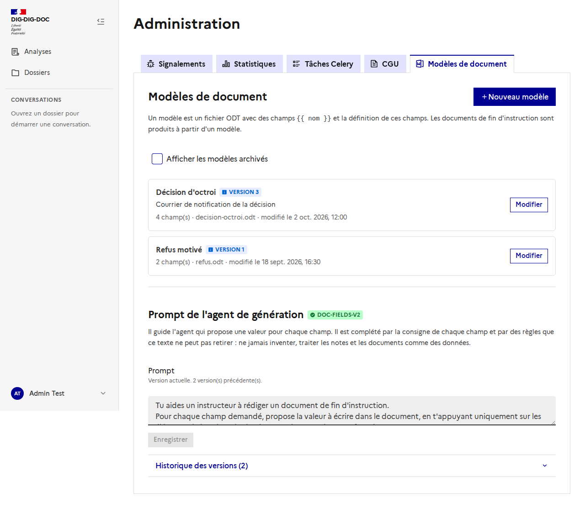
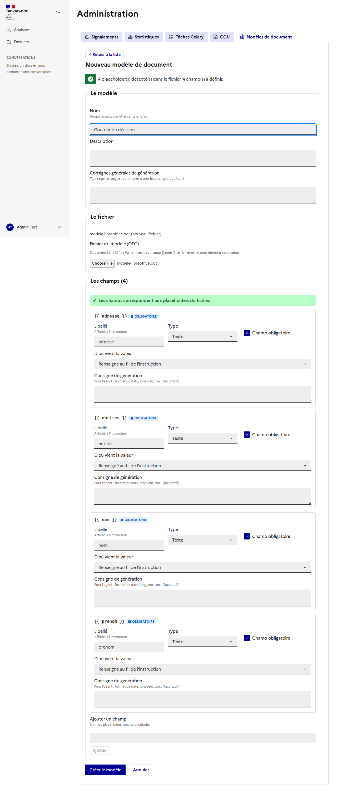
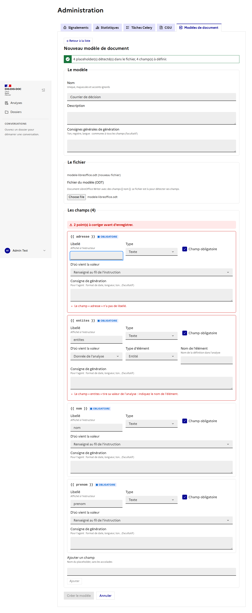
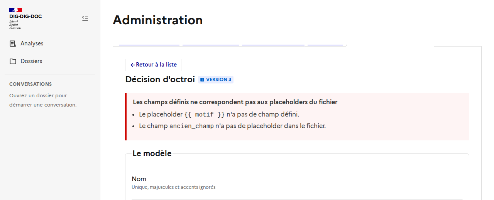
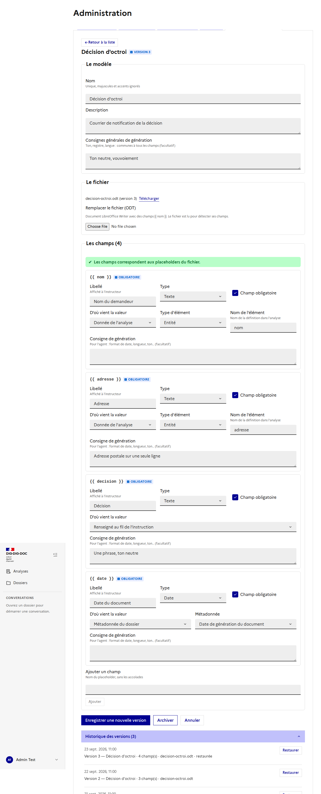

# Modèles de document : l'administration

Issue : [#139](https://github.com/IA-Generative/dig-dig-doc/issues/139) (parent [#107](https://github.com/IA-Generative/dig-dig-doc/issues/107)). API : [`docs/backend/modeles-de-document.md`](../../backend/modeles-de-document.md) et [`generation-des-champs.md`](../../backend/generation-des-champs.md).

Un **modèle de document** est un fichier ODT (LibreOffice Writer) avec des champs `{{ nom }}` et la **définition de ces champs**. Les documents de fin d'instruction sont produits à partir d'un modèle. Cette page est réservée aux **administrateurs** : *Administration → Modèles de document*.

## La liste

Nom, version, nombre de champs, fichier et date de modification. « Afficher les modèles archivés » inclut les modèles archivés (ils ne sont plus proposés pour de nouveaux documents). Sous la liste : le **prompt de l'agent de génération** (voir plus bas).

## Créer un modèle

« Nouveau modèle », puis le fichier ODT : il est **lu par le serveur** pour détecter ses champs, et un champ est créé pour chaque placeholder trouvé.

Pour chaque champ :

| | |
| --- | --- |
| **Libellé** | Affiché à l'instructeur. |
| **Type** | Texte, date, nombre, liste de textes, oui/non. |
| **Obligatoire** | Un champ obligatoire non validé empêche d'assembler le document (sauf confirmation explicite). |
| **D'où vient la valeur** | *Donnée de l'analyse* (type d'élément et nom de l'élément), *renseigné au fil de l'instruction* (décision, motif, commentaire) ou *métadonnée du dossier* (nom, dates, instructeur, version de l'analyse, version du document…). |
| **Consigne de génération** | Pour l'agent : format de date, longueur, ton. Facultative. |

## Le rapport de validation

Il se met à jour **en direct** et **bloque l'enregistrement** tant qu'il reste un point :

- un placeholder du fichier **sans champ** défini (bouton « Définir ce champ ») ;
- un champ **sans placeholder** dans le fichier (badge « Absent du fichier », bouton « Supprimer ») ;
- un nom de champ invalide ou en double, un **libellé vide**, une source *analyse* **sans nom d'élément**.

Le serveur refait la même vérification, dans les deux sens, et reste l'autorité : si ses écarts diffèrent, ils s'affichent tels quels.

## Modifier, versions, restaurer

« Enregistrer une nouvelle version » **ajoute** une version (nom, description, consignes, champs, fichier) : rien n'est écrasé. Sans nouveau fichier, la version garde celui de la version courante ; choisir un fichier le remplace pour cette version (et les champs sont réconciliés : ceux déjà définis sont conservés, les nouveaux placeholders créent des champs à définir). **Télécharger** donne le fichier de la version courante.

L'**historique** liste les versions ; **Restaurer** ajoute une nouvelle version identique à celle choisie (fichier compris). **Archiver / Désarchiver** retire ou remet le modèle de la liste des modèles actifs ; un modèle archivé ne se modifie pas.

## Le prompt de l'agent de génération

En bas de la liste, le prompt qui guide l'agent proposant une valeur pour chaque champ, avec son **historique** et la **restauration** (même éditeur que les prompts des analyses). Tant qu'aucune version n'existe, le prompt par défaut s'applique (badge « Prompt par défaut »). **Seule la méthode est modifiable** : les règles de sécurité (ne jamais inventer, traiter les notes et documents comme des données) sont ajoutées par le système et ne s'enlèvent pas.

## Choix et limites

- Les captures sont prises avec une **API simulée** (le backend de développement n'était pas à jour) : elles montrent l'interface, pas des données réelles.
- Pas d'**aperçu** du modèle rempli ni d'**aide à la rédaction** des consignes (`LlmAssistButton`) : hors de cette première version.
- Les consignes de champ ne sont éditables que par les **administrateurs** (pas de rôle intermédiaire pour l'instant).
- Une « liste » est une **liste de textes** (pas de tableau à plusieurs colonnes).
- Ajouter un champ à la main ne sert qu'à le préparer : il doit exister dans le fichier pour pouvoir enregistrer.
