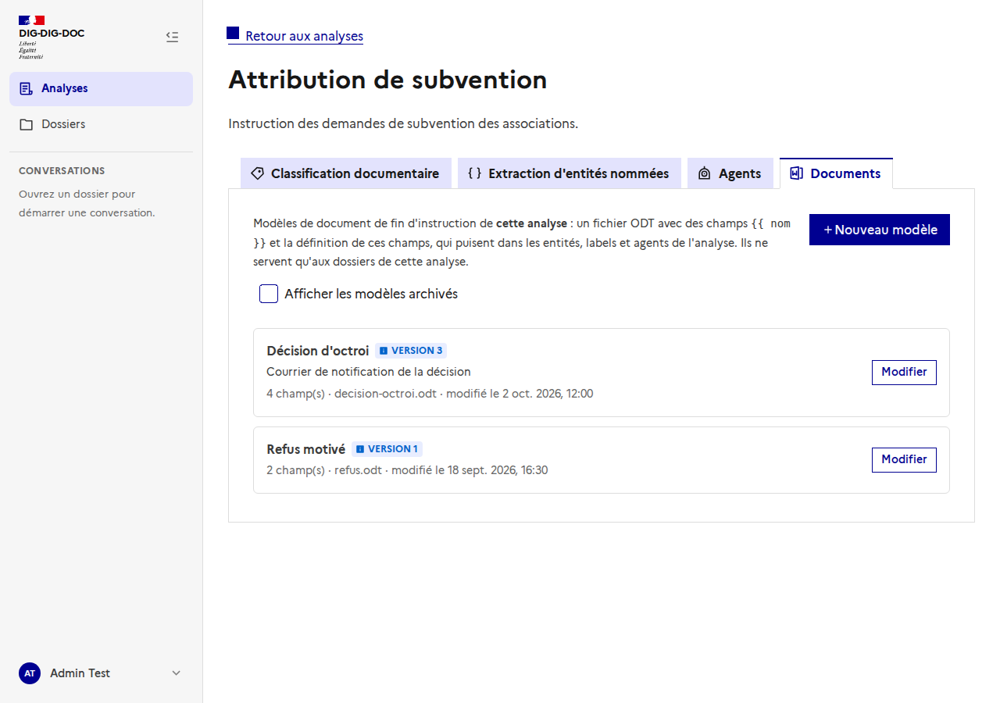
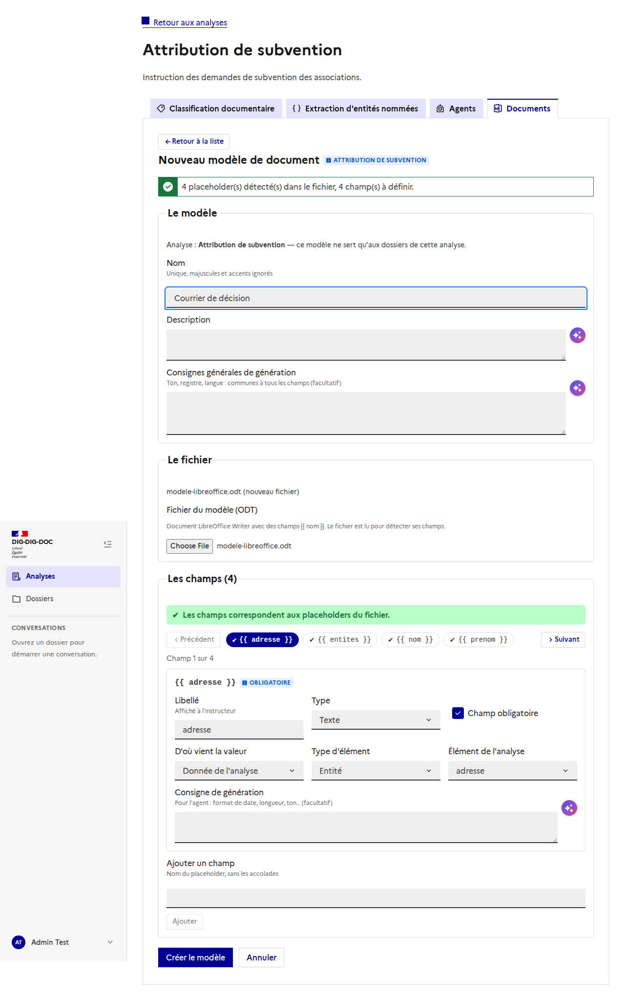
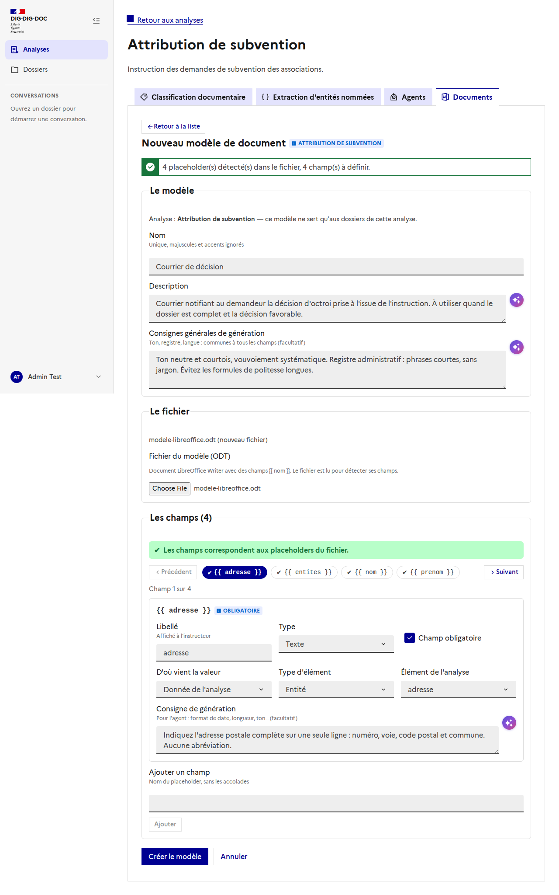
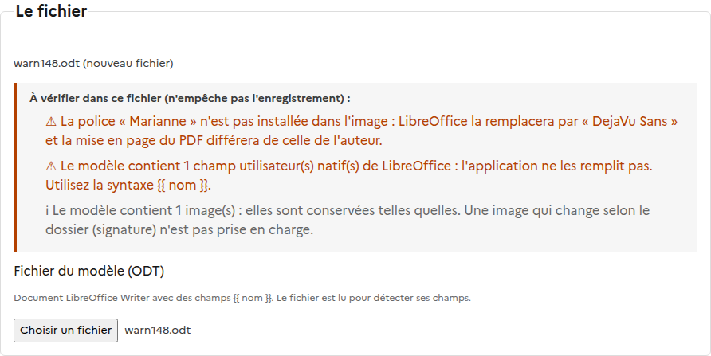
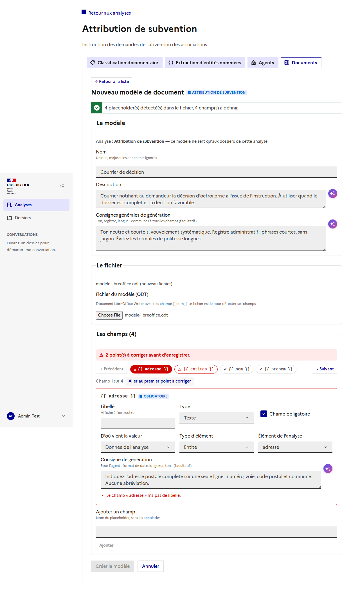
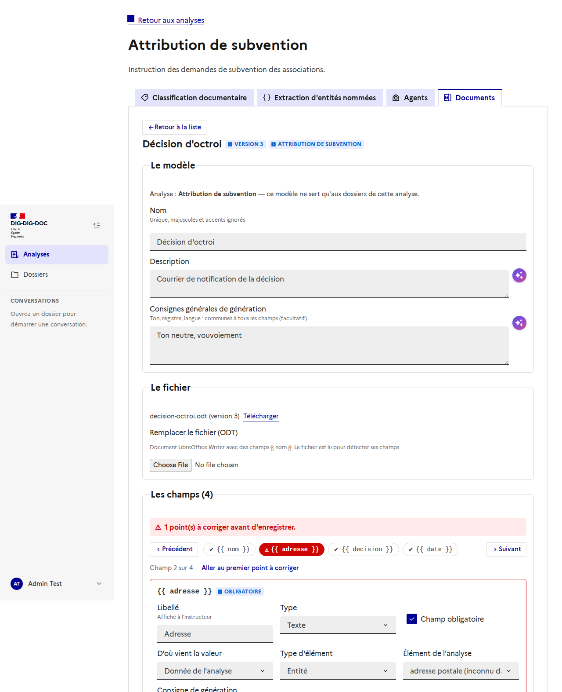
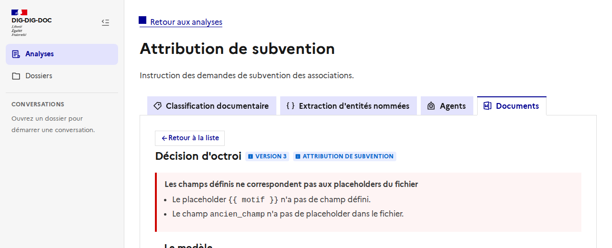
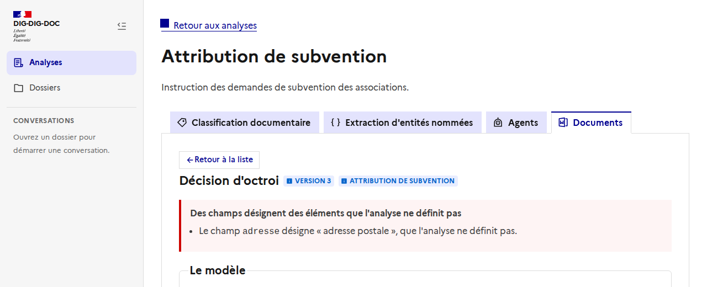
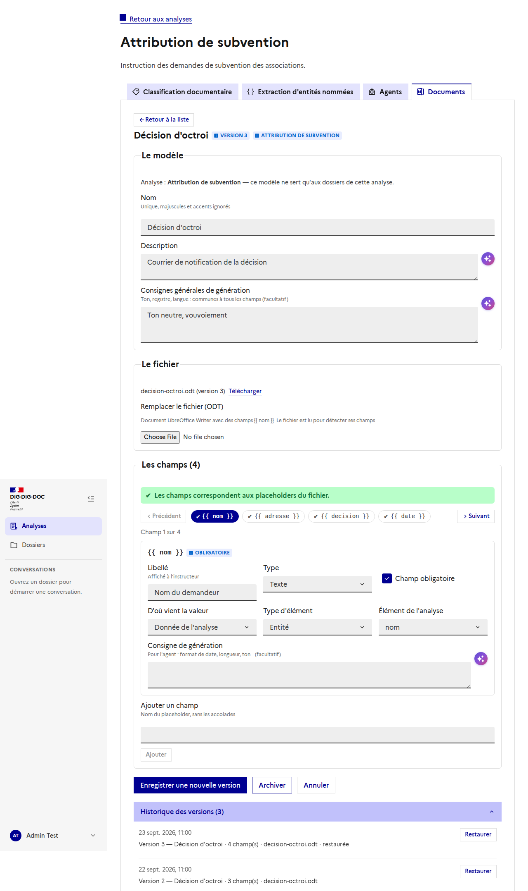
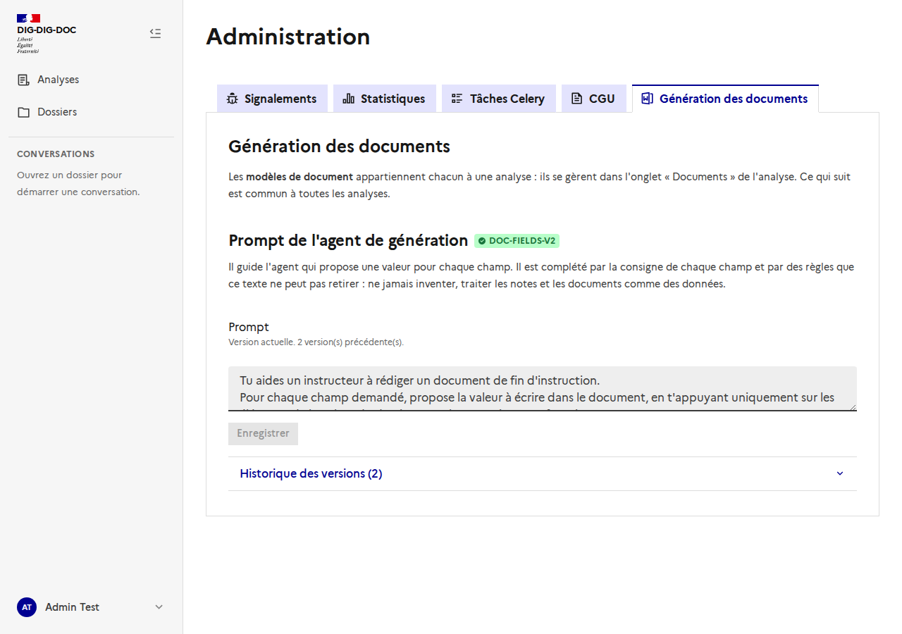

# Modèles de document : l'onglet « Documents » d'une analyse

Issue : [#139](https://github.com/IA-Generative/dig-dig-doc/issues/139) (parent [#107](https://github.com/IA-Generative/dig-dig-doc/issues/107)). API : [`docs/backend/modeles-de-document.md`](../../backend/modeles-de-document.md) et [`generation-des-champs.md`](../../backend/generation-des-champs.md).

Un **modèle de document** est un fichier ODT (LibreOffice Writer) avec des champs `{{ nom }}` et la **définition de ces champs**. Les documents de fin d'instruction sont produits à partir d'un modèle.

**Un modèle appartient à une analyse**, et à une seule : il ne sert qu'aux dossiers de cette analyse, et ses champs puisent dans ce qu'elle définit (entités, labels, agents). Rien n'est global : les modèles se gèrent **dans la page de l'analyse, onglet « Documents »**, à côté de la classification, de l'extraction et des agents. L'onglet est réservé aux **administrateurs** (comme l'API) : il est masqué pour les autres, et l'adresse directe `/analyses/<id>/documents` les renvoie hors de la page.

## La liste

L'onglet montre **les modèles de cette analyse**, et « Nouveau modèle » crée un modèle dans cette analyse (elle ne peut plus changer ensuite). Chaque ligne : nom, version, nombre de champs, fichier et date de modification. Le **nom est unique dans l'analyse** (deux analyses peuvent chacune avoir un « Courrier »). « Afficher les modèles archivés » inclut les modèles archivés (ils ne sont plus proposés pour de nouveaux documents).

## Créer un modèle

« Nouveau modèle », puis le fichier ODT : il est **lu par le serveur** pour détecter ses champs, et un champ est créé pour chaque placeholder trouvé.

### Les champs, en carrousel

Un seul champ est édité à la fois. Une **pastille par placeholder** donne son état (✔ complet, ⚠ à corriger) et permet d'y aller directement ; **Précédent / Suivant** parcourent les champs, et « Champ 2 sur 4 » indique la position. Quand il reste des points à corriger, « Aller au premier point à corriger » y emmène.

Pour chaque champ :

| | |
| --- | --- |
| **Libellé** | Affiché à l'instructeur. |
| **Type** | Texte, date, nombre, liste de textes, oui/non. |
| **Obligatoire** | Un champ obligatoire non validé empêche d'assembler le document (sauf confirmation explicite). |
| **D'où vient la valeur** | *Donnée de l'analyse* : un type d'élément et **un élément choisi dans la liste de ce que l'analyse définit** (entités, labels de classification, agents) ; pour une relation ou un champ renseigné, un nom libre. *Renseigné au fil de l'instruction* (décision, motif, commentaire) ou *métadonnée du dossier* (nom, dates, instructeur, version de l'analyse, version du document…). |
| **Consigne de génération** | Pour l'agent : format de date, longueur, ton. Facultative. |

## Aide à la rédaction

Le bouton violet (✦) à droite d'une zone de texte propose une rédaction par le LLM, comme ailleurs dans l'application : **la description**, **les consignes générales** et **la consigne de chaque champ**. Il tient compte de ce qui est déjà écrit (pour l'améliorer), du nom et de la description du modèle, et pour un champ de son libellé, de son type et de sa source. La suggestion **remplace le texte dans la zone, reste modifiable** et n'est enregistrée qu'avec le modèle. Si le LLM n'est pas disponible, un message s'affiche sous la zone et le texte n'est pas touché.

## Contrôle du fichier à l'import

À l'import, le serveur ne se contente pas de lire les champs : il **contrôle le fichier** et signale, **sans rien bloquer**, ce qui risque de donner un PDF différent de ce que voit l'auteur :

- **Police absente de l'image** : LibreOffice la remplace sans prévenir (« Marianne » deviendrait « DejaVu Sans »). Les polices d'usage courant dont l'image a un équivalent de **mêmes métriques** (Arial, Times New Roman, Calibri, Cambria…) ne déclenchent pas d'avertissement.
- **Champs natifs LibreOffice** (champs utilisateur, variables, champs de saisie) : l'application ne les remplit pas ; seule la syntaxe `{{ nom }}` l'est.
- **Images** : conservées telles quelles (un logo). Une image qui change selon le dossier (signature) n'est pas prise en charge.

Les avertissements sont **conservés avec la version** : on les retrouve en rouvrant le modèle.

## Le rapport de validation

Il se met à jour **en direct** et **bloque l'enregistrement** tant qu'il reste un point :

- un placeholder du fichier **sans champ** défini (bouton « Définir ce champ ») ;
- un champ **sans placeholder** dans le fichier (badge « Absent du fichier », bouton « Supprimer ») ;
- un nom de champ invalide ou en double, un **libellé vide**, une source *analyse* **sans élément** ;
- une source qui désigne **un élément que l'analyse ne définit pas** (par exemple une entité supprimée de l'analyse depuis) : le champ affiche « (inconnu dans l'analyse) ».

Le serveur refait la même vérification, dans les deux sens, et reste l'autorité : si ses écarts diffèrent, ils s'affichent tels quels.

## Modifier, versions, restaurer

« Enregistrer une nouvelle version » **ajoute** une version (nom, description, consignes, champs, fichier) : rien n'est écrasé. Sans nouveau fichier, la version garde celui de la version courante ; choisir un fichier le remplace pour cette version (et les champs sont réconciliés : ceux déjà définis sont conservés, les nouveaux placeholders créent des champs à définir). **Télécharger** donne le fichier de la version courante.

L'**historique** liste les versions ; **Restaurer** ajoute une nouvelle version identique à celle choisie (fichier compris). **Archiver / Désarchiver** retire ou remet le modèle de la liste des modèles actifs ; un modèle archivé ne se modifie pas.

## Le prompt de l'agent de génération (Administration)

Le prompt de l'agent qui propose une valeur pour chaque champ est **commun à toutes les analyses** : il reste dans *Administration → Génération des documents*, avec son **historique** et la **restauration** (même éditeur que les prompts des analyses). Tant qu'aucune version n'existe, le prompt par défaut s'applique (badge « Prompt par défaut »). **Seule la méthode est modifiable** : les règles de sécurité (ne jamais inventer, traiter les notes et documents comme des données) sont ajoutées par le système et ne s'enlèvent pas.

## Choix et limites

- L'onglet est **réservé aux administrateurs**, comme l'API des modèles ; l'ouvrir aux autres utilisateurs de l'analyse est une décision à prendre (#138 : « administrateurs d'abord »).
- Les onglets de la page d'une analyse n'avaient **qu'un seul panneau** : `DsfrTabs` mesure le panneau de l'onglet actif, donc les onglets autres que le premier (extraction, agents) étaient **coupés**. Un panneau par onglet corrige aussi l'existant.
- **Pas de duplication** d'un modèle vers une autre analyse pour l'instant : un courrier commun à deux analyses se recrée dans chacune.
- Un modèle créé **avant** ce rattachement n'a pas d'analyse : il n'est proposé à aucun dossier et n'apparaît dans aucune liste par analyse.
- Une source déjà enregistrée peut devenir inconnue si l'analyse change ; elle est signalée à la prochaine modification, et au moment de générer un brouillon le champ reste simplement non renseigné.
- Les captures sont prises avec une **API simulée** (le backend de développement n'était pas à jour) : elles montrent l'interface, pas des données réelles.
- Pas d'**aperçu** du modèle rempli : hors de cette première version.
- L'aide à la rédaction a été vue avec un LLM simulé ; avec le vrai LLM, la qualité des suggestions n'est pas évaluée.
- Les consignes de champ ne sont éditables que par les **administrateurs** (pas de rôle intermédiaire pour l'instant).
- Une « liste » est une **liste de textes** (pas de tableau à plusieurs colonnes).
- Ajouter un champ à la main ne sert qu'à le préparer : il doit exister dans le fichier pour pouvoir enregistrer.
