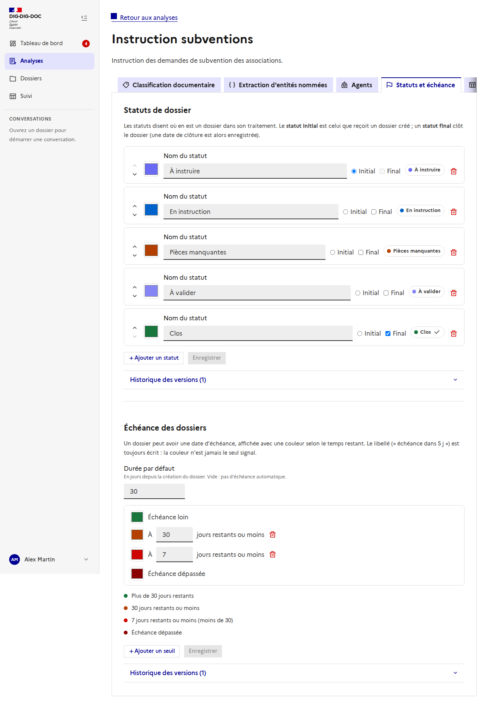
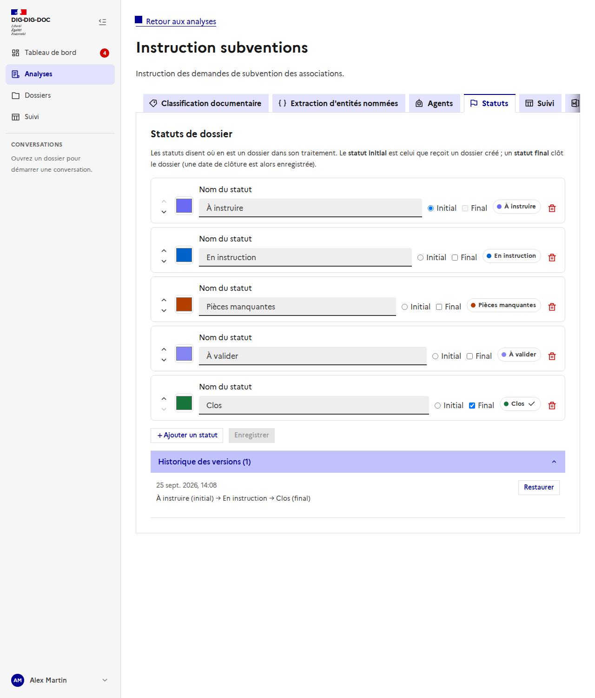
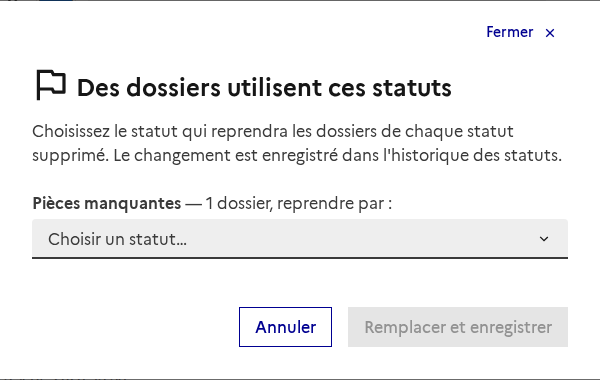
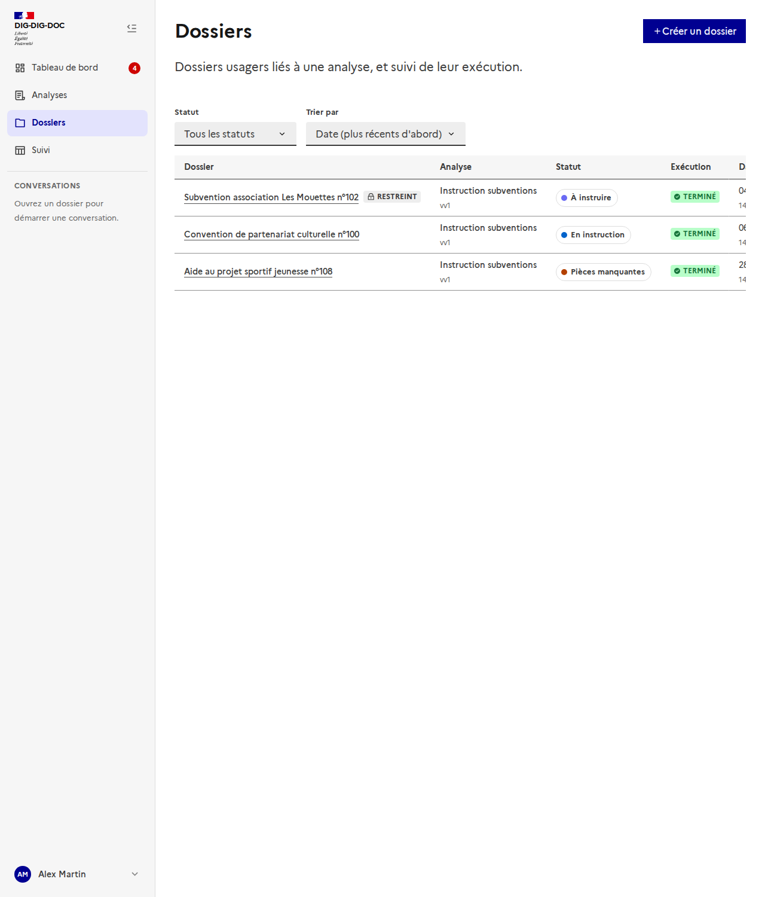
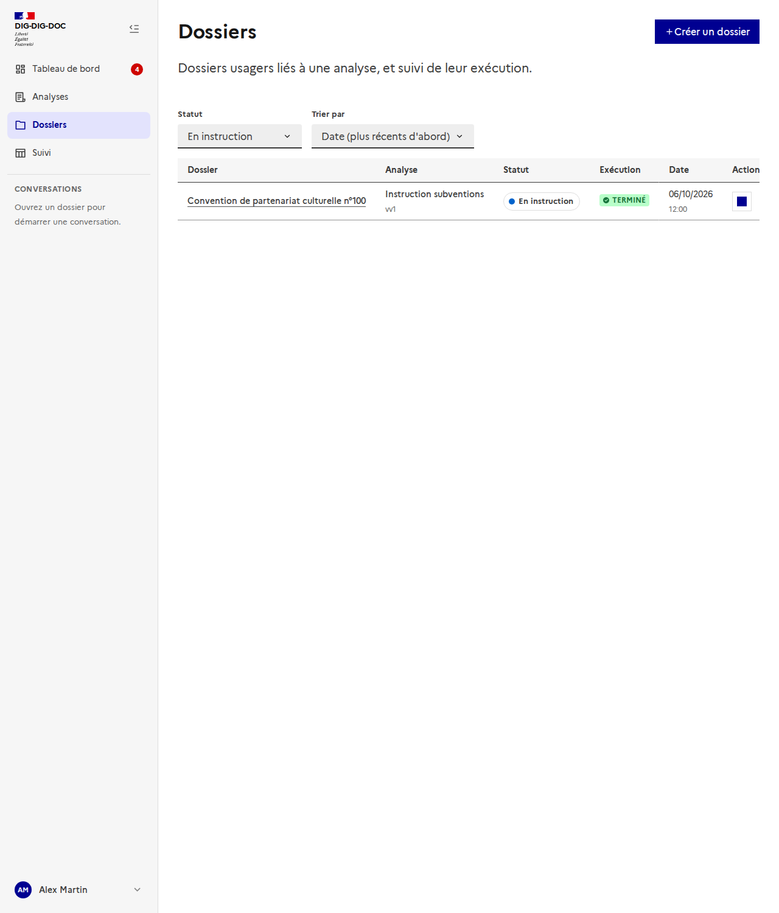
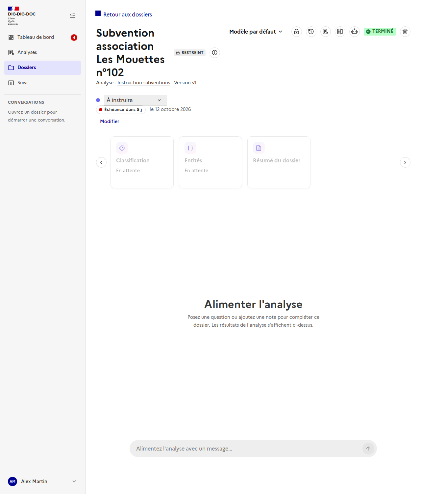

# Statuts de dossier : configuration, liste et changement de statut

Issue : [#170](https://github.com/IA-Generative/mille-feuille/issues/170) (parent [#167](https://github.com/IA-Generative/mille-feuille/issues/167)). API : [`statuts-de-dossier`](../../backend/statuts-de-dossier.md).

Chaque **analyse** définit les **statuts** que peuvent prendre ses dossiers (« À instruire », « En instruction », « Clos »…). Le **statut de dossier** dit où en est le traitement ; il est **distinct** de l'état d'**exécution** de l'analyse automatique (« En attente », « En cours », « Terminé »), qui garde sa propre colonne.

## Configurer les statuts d'une analyse

Onglet **« Statuts et échéance »** de l'analyse (`/analyses/<id>/statuts`) ; la section Échéance est décrite dans [l'échéance du dossier](../echeance-du-dossier/README.md).

Chaque ligne a un **nom**, une **couleur**, l'indicateur **Initial** et l'indicateur **Final**, avec un aperçu de la pastille :

- **Initial** : le statut que reçoit un dossier créé ou rattaché à l'analyse. **Un seul** par analyse (le choisir retire l'indicateur des autres) ; un statut initial ne peut pas être final.
- **Final** : le dossier est **clos** dans ce statut ; une **date de clôture** est alors enregistrée (elle s'efface si le dossier est rouvert). La pastille porte une coche.
- Les flèches **réordonnent** les statuts (utilisables au clavier) ; l'ordre est celui des menus et du tri.
- « Enregistrer » reste inactif tant que la liste n'a pas changé ou n'est pas valide ; les erreurs sont écrites sous la liste (au moins un statut, un nom par statut, noms uniques, exactement un statut initial).

Un statut **garde son identité** quand on le renomme ou qu'on le déplace : les dossiers qui l'ont continuent de l'avoir.

### Historique et restauration

Comme tout champ éditable d'une analyse, la liste des statuts est **versionnée** : chaque enregistrement conserve l'état précédent, et « **Restaurer** » en ajoute une version (rien n'est écrasé). Restaurer **recrée** avec son identité un statut supprimé depuis.

### Supprimer un statut utilisé

Supprimer un statut encore porté par des dossiers n'est pas possible tel quel : une fenêtre indique, pour chaque statut, **combien de dossiers** l'ont et demande le **statut qui les reprend**. Les dossiers sont déplacés, et leur date de clôture suit le caractère final du nouveau statut. Un statut inutilisé se supprime directement. La même fenêtre s'ouvre si une **restauration** supprimerait des statuts utilisés.

## Dans la liste des dossiers

- La colonne **Statut** montre la pastille du statut de dossier (le nom est toujours écrit : la couleur n'est jamais le seul signal) ; l'ancienne colonne de statut s'appelle désormais **Exécution**. Un dossier « à ranger » (sans analyse) n'a pas de statut.
- Le filtre **Statut** liste les statuts de toutes les analyses (préfixés du nom de l'analyse quand il y en a plusieurs) ; **Trier par** propose la date (par défaut) ou le **statut**, dans l'ordre défini par chaque analyse, les dossiers sans statut en dernier. Changer de filtre ou de tri ramène à la première page.

Le filtre se lit dans l'URL (`/dossiers?status=<id>`) : le tableau de bord et le suivi peuvent y renvoyer.

## Changer le statut d'un dossier

Dans l'en-tête du dossier, sous l'analyse, un menu propose les statuts **de son analyse**, dans leur ordre (les statuts finaux sont marqués « final »). Choisir un statut final **clôt** le dossier : « Clôturé le … » s'affiche ; en choisir un autre le rouvre. Une erreur du serveur (par exemple un statut qui n'appartient pas à l'analyse) s'affiche sous le menu.

## Choix et limites

- **Transitions libres** : on peut passer d'un statut à n'importe quel autre de l'analyse. Les contraindre (A vers B seulement) reste une question ouverte de #167.
- **Droits** : comme les autres routes de configuration d'une analyse, la configuration des statuts est ouverte à tout utilisateur connecté ; les restrictions viendront avec l'accès par groupe (#177) et les rôles (#178).
- **Pas encore de trace** des changements de statut : le journal du dossier (#169) les enregistrera.
- Le **tableau de suivi** (#173) utilise encore des statuts simulés ; il sera branché sur ceux-ci.
- Les captures sont prises par `frontend/scripts/doc-screenshots.mjs` avec l'API interceptée.
