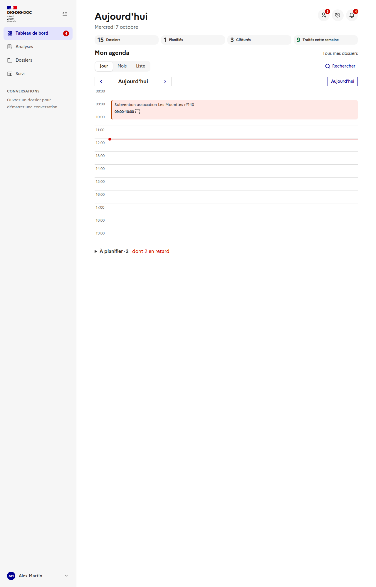
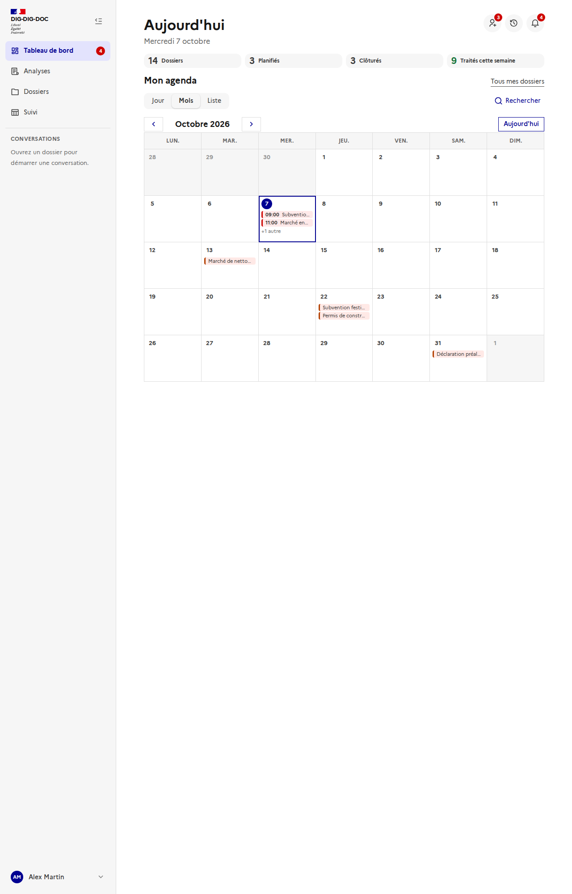
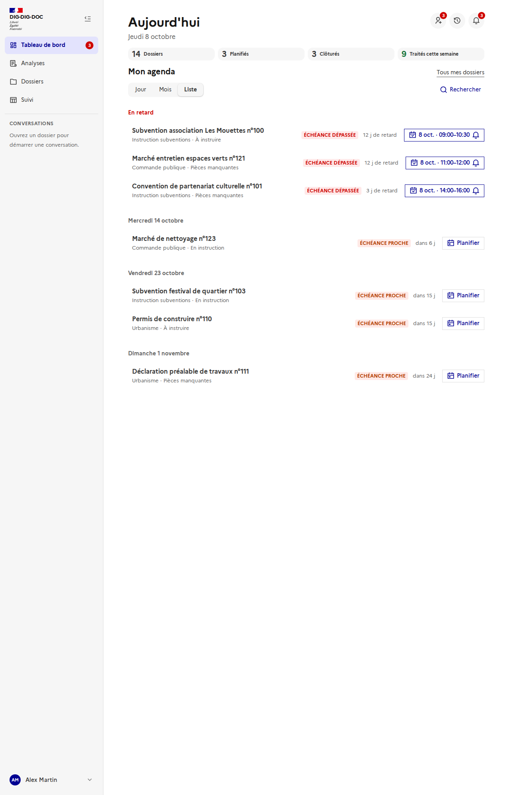
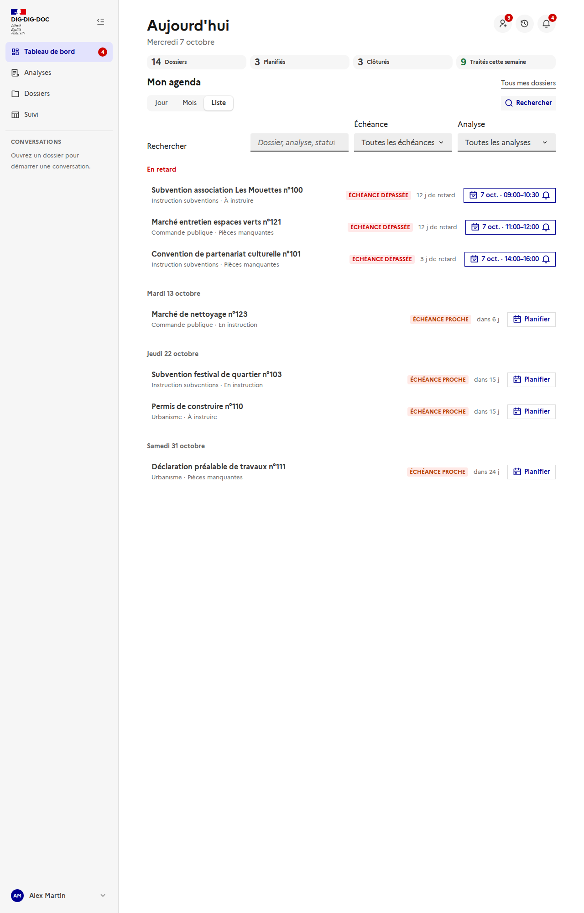
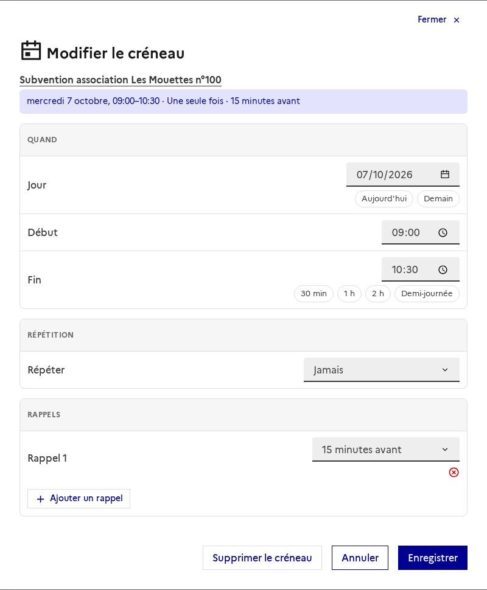
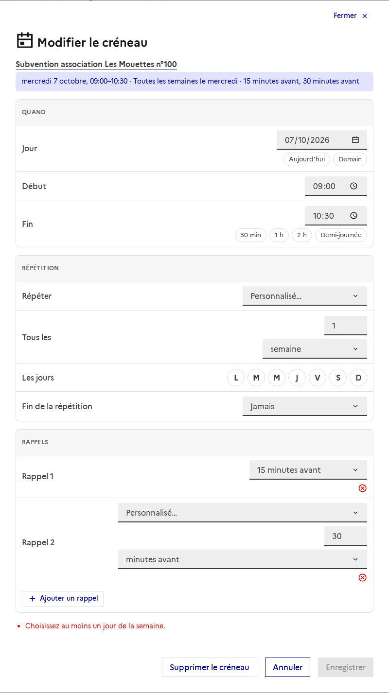
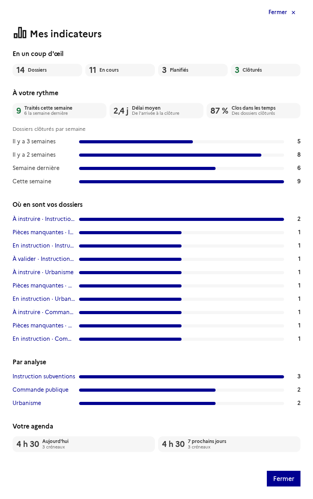
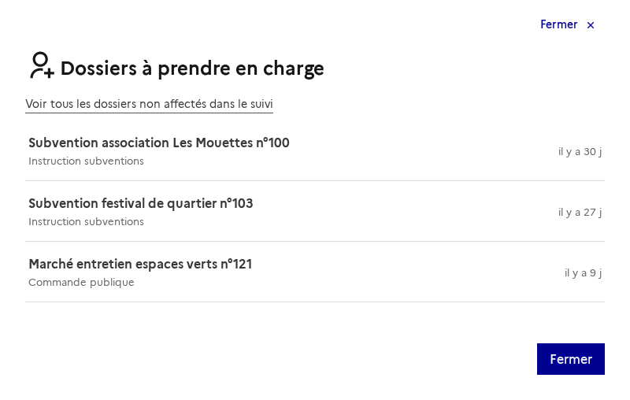
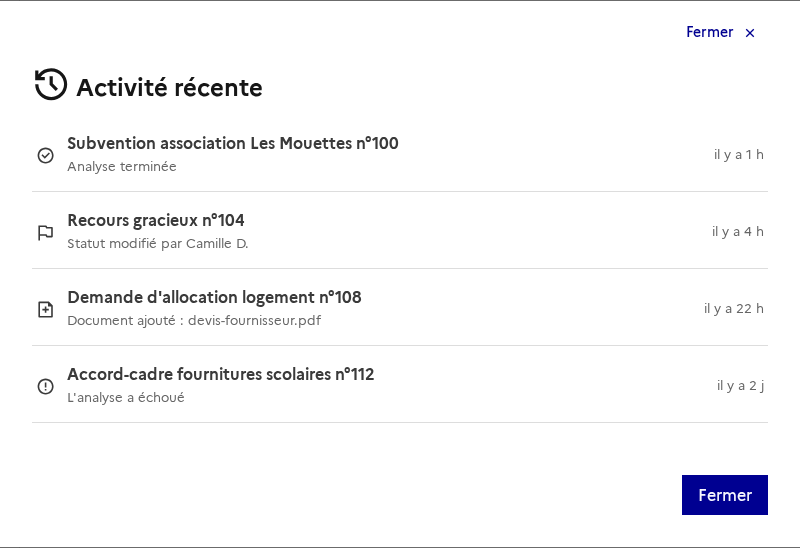

# Tableau de bord : agenda, créneaux, rappels et notifications

Issue : [#174](https://github.com/IA-Generative/mille-feuille/issues/174) (parent [#167](https://github.com/IA-Generative/mille-feuille/issues/167)). Les dossiers ouverts depuis cette page se pilotent dans le [tableau de suivi](../tableau-de-suivi/README.md) ; les règles d'accès sont décrites dans [accès aux dossiers par groupe](../acces-aux-dossiers/README.md).

Page d'accueil de l'utilisateur connecté : **ses priorités sous forme d'agenda**, quatre indicateurs simples, la possibilité de **planifier** le traitement d'un dossier (avec récurrence et rappels) et ses **notifications**. L'écran est volontairement épuré : une information principale, le reste à la demande dans des fenêtres.

> **Branché sur l'API pour les dossiers** : indicateurs, urgences, statuts, non affectés et activité viennent du serveur. Les **créneaux** sont enregistrés côté serveur ; les **notifications**, rappels de créneau compris, viennent du serveur : voir « Choix et limites ».

## Y accéder

Entrée **« Tableau de bord »** de la barre latérale (page `/dashboard`, ouverte après la connexion). Une pastille y indique le nombre de notifications non lues (plafonné à « 99+ », annoncé aux lecteurs d'écran).

## La page

- **En-tête** : « Aujourd'hui » et la date, puis trois boutons ronds, chacun avec une pastille de nombre : **dossiers à prendre en charge** (rôles autorisés seulement), **activité récente** et **notifications**. Chacun ouvre une fenêtre.
- **Indicateurs** : *Dossiers* (tous mes dossiers), *Planifiés* (ceux qui ont un créneau), *Clôturés* et *Traités cette semaine*. Un clic ouvre le détail (voir plus bas). Le ton est neutre : pas de rouge ni d'objectif.
- **Mon agenda** : trois vues (**Jour**, **Mois**, **Liste**), une recherche repliée derrière « Rechercher », et le lien **Tous mes dossiers** vers le suivi.

### Vue Jour

La journée heure par heure (8 h–20 h), ouverte sur aujourd'hui.

- Chaque **créneau planifié** est un bloc positionné à son horaire ; deux créneaux qui se chevauchent s'affichent côte à côte. Un clic sur un bloc ouvre la fenêtre de planification. La ligne rouge marque l'**heure courante**.
- Les flèches font défiler les jours, « Aujourd'hui » revient à la date du jour.
- La section repliée **« À planifier · n »** liste les dossiers sans créneau et ceux **en retard** (« dont n en retard »), chacun avec un bouton « Planifier ».

### Vue Mois

Grille du mois, du lundi au dimanche. Chaque dossier figure à la date de son créneau (un créneau **récurrent** apparaît à chaque occurrence) ou, à défaut, à son échéance ; la pastille est rouge si l'échéance est dépassée et orange sinon. Un clic sur un jour ouvre la vue Jour correspondante.

### Vue Liste

Les urgences, **triées par échéance et groupées par jour** (« En retard », « Aujourd'hui », « Demain », puis la date), **paginées** (8 par page). Chaque ligne affiche l'analyse, le statut, un badge d'échéance **avec libellé** (« Échéance dépassée », « 8 j de retard ») et le bouton de planification, qui devient le résumé du créneau une fois planifié (avec les icônes de répétition et de rappel).

### Rechercher et filtrer

« Rechercher » déplie la recherche (dossier, analyse, statut) et le filtre par analyse. Dans la vue Liste, un filtre d'**échéance** s'y ajoute (dépassées, aujourd'hui, cette semaine, plus tard). « Réinitialiser » efface les filtres.

## Planifier un créneau de traitement

Un clic sur « Planifier » (ou sur un bloc de la vue Jour) ouvre la fenêtre, en trois blocs inspirés du calendrier iOS. Un **résumé lisible** en haut se met à jour en direct (« mercredi 7 octobre, 09:00–10:30 · Tous les jours ouvrés · 15 minutes avant »).

| Bloc | Contenu |
| --- | --- |
| **Quand** | Jour (raccourcis *Aujourd'hui* et *Demain*), début, fin, durées rapides (30 min, 1 h, 2 h, demi-journée). La fin doit suivre le début. |
| **Répétition** | Jamais, tous les jours, toutes les semaines, toutes les 2 semaines, tous les mois, tous les ans, ou **personnalisé**. |
| **Rappels** | Jusqu'à 3, prédéfinis (à l'heure, 5 min, 15 min, 30 min, 1 h, 2 h, 1 jour, 2 jours, 1 semaine avant) ou **personnalisés**. |

- **Personnalisé** : « Tous les *N* jours / semaines / mois / ans », les **jours de la semaine** (L M M J V S D) pour les semaines, et la **fin de la répétition** (jamais, à une date, après *N* fois). Un mois trop court ramène le jour au dernier jour du mois.
- **Rappels personnalisés** : *N* minutes, heures ou jours avant ; les doublons sont fusionnés.
- « **Supprimer le créneau** » retire le créneau et ses rappels.

## Indicateurs

« Mes indicateurs » regroupe des **repères, pas des objectifs** : en un coup d'œil (dossiers, en cours, planifiés, clôturés), à votre rythme (traités cette semaine, délai moyen, part clôturée dans les temps, dossiers clôturés par semaine), répartition **par statut** et **par analyse** (chaque ligne ouvre le suivi filtré sur mes dossiers), et temps planifié (aujourd'hui et sur 7 jours).

## Notifications

La cloche ouvre la fenêtre des notifications, avec des **catégories** (*Affectations*, *Échéances*, *Statuts*, *Analyses*, *Rappels*), le compteur de non lues de chacune, le marquage individuel (un clic sur une notification la lit et ouvre le dossier) et « **Tout marquer comme lu** ».

- **Alertes du navigateur** : un bandeau propose d'activer les alertes système (le navigateur demande l'autorisation à ce moment-là). Chaque **rappel** de créneau génère alors une alerte, et un clic dessus ramène sur le dossier. Si le navigateur les bloque, le bandeau l'explique.
- **Accès retiré** : la notification d'un dossier auquel on n'a plus accès reste dans la liste, mais sans lien ni nom (« Dossier non accessible »). Voir [accès aux dossiers par groupe](../acces-aux-dossiers/README.md).
- Pas d'auto-notification : l'auteur d'une action n'est pas notifié de sa propre action.

### Dossiers à prendre en charge et activité récente

Le premier bouton (rôles autorisés) liste les dossiers **non affectés** et renvoie vers le suivi filtré sur eux. Le second donne l'**activité récente** sur mes dossiers.

## Accessibilité

- Les nombres (pastilles, compteurs) sont **annoncés**, pas seulement affichés.
- Les badges d'échéance portent un **libellé** : la couleur n'est jamais le seul signal.
- Tout se fait **au clavier** ; les changements de vue et les retours d'action sont annoncés.
- Les animations respectent « réduire les animations ».

## Choix et limites

- **Branché sur l'API** : indicateurs, urgences, dossiers par statut, dossiers à prendre en charge et activité récente viennent de `GET /api/dashboard` ([`tableau-de-bord`](../../backend/tableau-de-bord.md)). L'échéance proche ou dépassée suit les **seuils de l'analyse**, calculés par le serveur ([échéance](../echeance-du-dossier/README.md)).
- **Créneaux** : enregistrés côté serveur, **privés** et toujours rattachés à un dossier ([`creneaux-de-traitement`](../../backend/creneaux-de-traitement.md)) ; ils survivent au rechargement et se retrouvent d'un poste à l'autre. Le partage de son agenda viendra plus tard. Une erreur d'enregistrement s'affiche au-dessus de l'agenda.
- **Notifications** : elles viennent du serveur ([`notifications`](../../backend/notifications.md)) et se mettent à jour toutes les **60 secondes** tant que la page est visible. Elles couvrent les affectations, les échéances qui approchent ou sont dépassées, les changements de statut par un tiers et la fin d'une analyse que vous avez lancée ; l'auteur d'une action n'est jamais notifié. Lues, elles sont conservées 90 jours.
- **Rappels** : ils sont générés **par le serveur** à partir des créneaux (récurrence et changements d'heure compris, un seul rappel par occurrence) et arrivent comme les autres notifications, toutes les 60 secondes tant que la page est visible. L'alerte du navigateur, si elle est activée, s'affiche à leur arrivée. Application fermée, un rappel de moins de 6 heures est rattrapé à l'ouverture ; un plus ancien n'est pas rejoué. Prévenir application fermée suppose le Web Push (service worker, clés VAPID, envoi serveur), hors périmètre.
- **Dossiers à prendre en charge** : visibles des seuls administrateurs en attendant les rôles d'instruction ([#178](https://github.com/IA-Generative/mille-feuille/issues/178)). Les règles d'accès par groupe ([#177](https://github.com/IA-Generative/mille-feuille/issues/177)) ne s'appliquent pas encore.
- **Où en sont vos dossiers** : les statuts sont propres à chaque analyse ; dès que plusieurs analyses sont concernées, chaque ligne nomme la sienne (« À instruire · Urbanisme »).
- **Alertes du navigateur** : l'API Notification n'alerte que **tant que la page est ouverte**. Prévenir application fermée suppose le Web Push (service worker, clés VAPID, envoi serveur), hors périmètre.
- **États de l'interface** : `?mock=empty` (états vides), `?mock=error` (erreur), `?mock=loading` (chargement) et `?mock=nounassigned` (sans le droit « non affectés ») permettent de les voir.
- Les captures sont prises par `frontend/scripts/doc-screenshots.mjs` avec l'API interceptée, sans backend ni Keycloak (voir en tête du script) ; les créneaux de l'agenda y sont planifiés par l'interface avant la capture (l'API simulée les garde le temps du scénario).
