# Tableau de suivi des dossiers

Issues : [#173](https://github.com/IA-Generative/dig-dig-doc/issues/173) (tableau, par analyse) et [#186](https://github.com/IA-Generative/dig-dig-doc/issues/186) (vue transversale), parent [#167](https://github.com/IA-Generative/dig-dig-doc/issues/167). Le [tableau de bord](../tableau-de-bord/README.md) y renvoie par des liens filtrés ; les règles d'accès sont dans [accès aux dossiers par groupe](../acces-aux-dossiers/README.md).

Un **tableau de pilotage des dossiers** : qui s'en occupe, où ils en sont, quelle est leur échéance, plus des **colonnes personnalisées** définies par l'administrateur de l'analyse. Il existe **à deux niveaux** avec le même composant : dans chaque analyse, et en **vue transversale** sur toutes les analyses accessibles.

> **Partie interface seulement.** Les données (60 dossiers sur 5 analyses) sont simulées en attendant le backend (statuts #168, échéance #172, affectations) : voir « Choix et limites ».

## Y accéder

- **Par analyse** : onglet **« Suivi »** d'une analyse (`/analyses/<id>/suivi`), entre « Agents » et « Documents ».
- **Transversal** : entrée **« Suivi »** de la barre latérale (`/suivi`).

## Le tableau

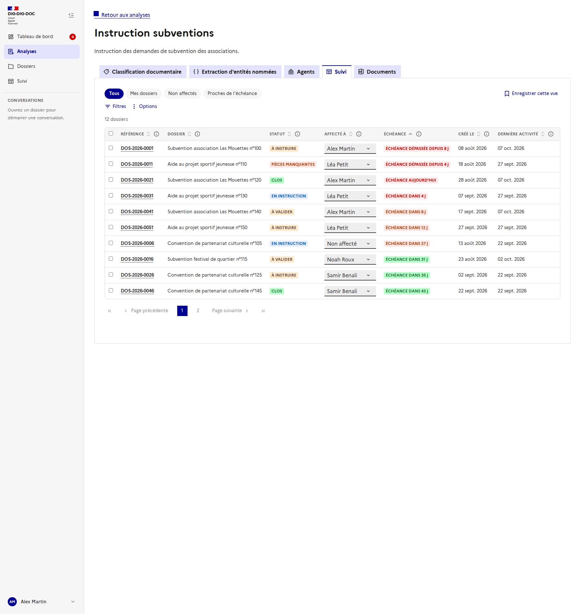

Une ligne par dossier : **référence** (lien vers le dossier, avec la pastille « Restreint » le cas échéant), **nom**, statut, **affecté à**, **échéance**, dates de création et de dernière activité, puis les colonnes personnalisées de l'analyse.

- **Tri** : un clic sur un en-tête trie la colonne (le sens est annoncé aux lecteurs d'écran).
- **Pagination** : 10 dossiers par page, avec le total au-dessus du tableau. Le tri, les filtres et la pagination sont faits « côté serveur » : les mêmes appels serviront avec l'API.
- **Échéance** : badge coloré **et libellé** (« Échéance dans 8 j », « Échéance dépassée depuis 4 j ») ; la couleur suit les seuils de l'analyse et n'est jamais le seul signal.
- **Définition d'une colonne** : le bouton « i » de chaque en-tête ouvre une bulle avec sa **définition**.

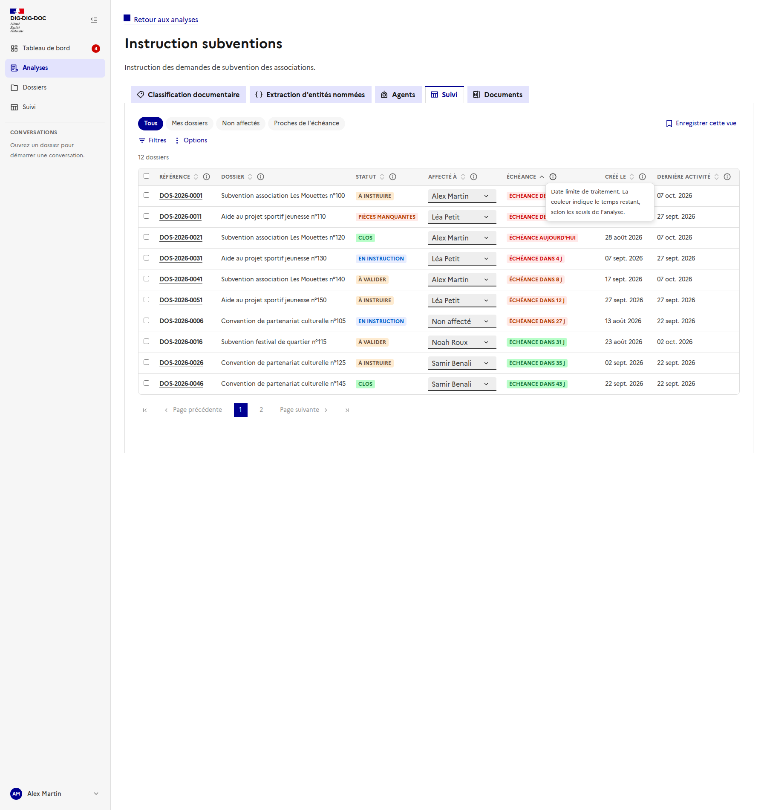

### Vues

Les pastilles du haut sont des **vues** : *Tous*, *Mes dossiers*, *Non affectés*, *Proches de l'échéance* (7 jours ou moins). Un point apparaît sur la vue active dès qu'on a modifié ses filtres ou son tri. « **Enregistrer cette vue** » en crée une, à son nom (filtres et tri) ; elle se supprime depuis sa pastille. Les vues enregistrées sont **personnelles**.

## Filtrer

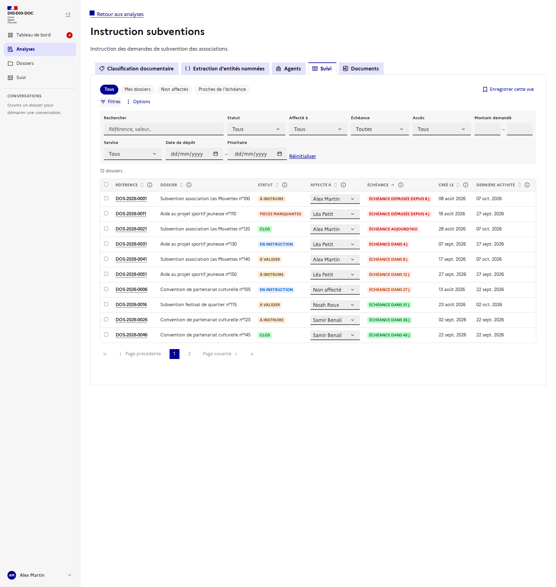

« Filtres » déplie : la **recherche** (référence, nom, valeurs), le **statut**, **affecté à** (moi, non affectés, une personne), l'**échéance** (dépassées, ≤ 7 j, ≤ 30 j, sans échéance), l'**accès** (restreints, selon l'analyse), puis un filtre par **colonne personnalisée** adapté à son type : texte, liste, oui/non, plage pour un nombre, un montant ou une date. « Réinitialiser » efface tout.

## Affecter

Dans la colonne « Affecté à », le menu de chaque ligne réaffecte directement le dossier. Pour une **affectation en lot**, on coche des lignes (la case de l'en-tête sélectionne la page) : une barre apparaît.

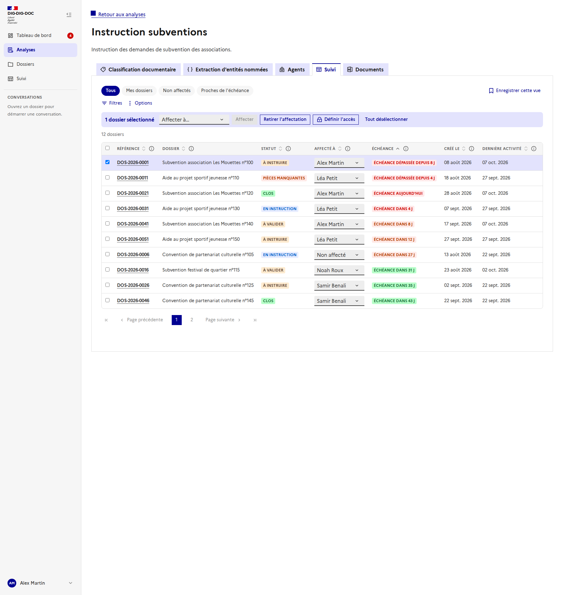

- **Affecter à…** puis « Affecter », ou « **Retirer l'affectation** ».
- On ne peut affecter qu'une personne **qui a accès au dossier** : le menu d'une ligne ne propose qu'elles, et en lot les dossiers refusés sont signalés.
- « **Définir l'accès** » (administrateurs) applique un accès à la sélection : voir [accès aux dossiers](../acces-aux-dossiers/README.md).
- Chaque affectation est confirmée dans une zone annoncée et notée comme **tracée dans l'historique** du dossier.

## Options

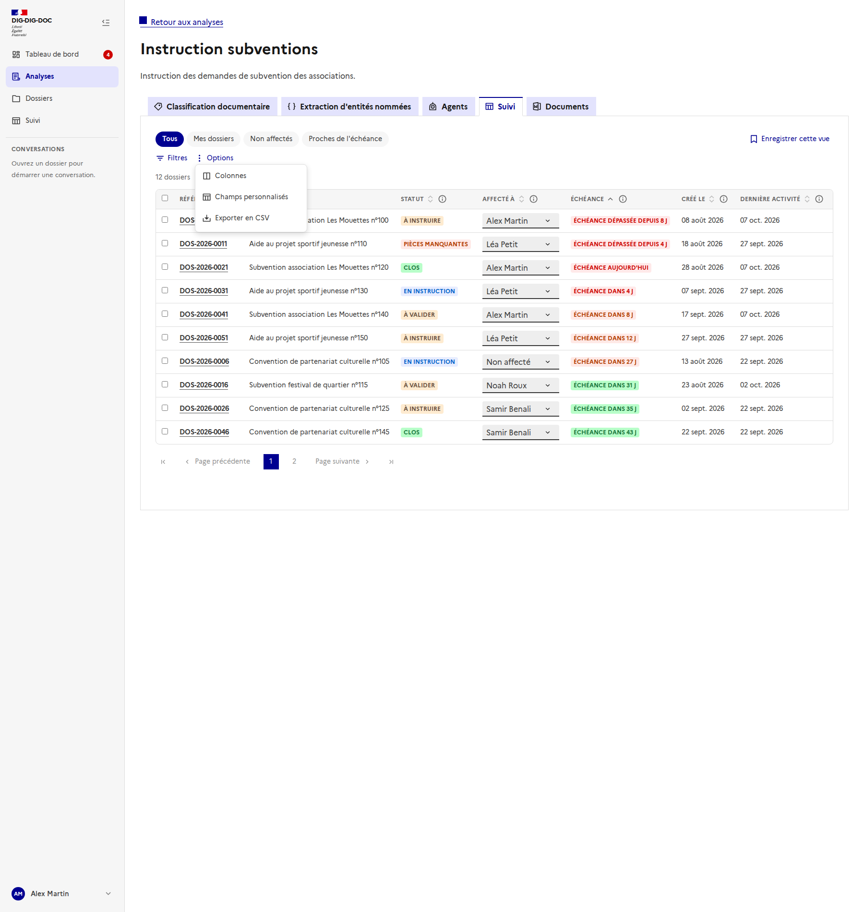

Le menu **Options** regroupe : **Colonnes**, **Champs personnalisés** (administrateurs, dans l'onglet d'une analyse) et **Exporter en CSV**.

### Colonnes

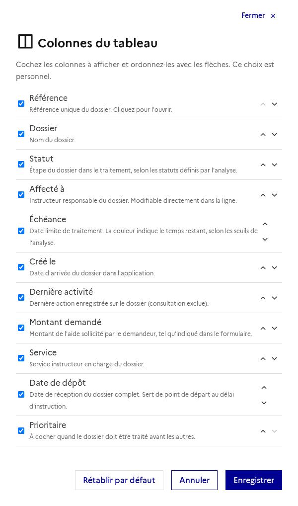

On coche les colonnes à afficher et on les **ordonne** avec les flèches (utilisables au clavier) ; chacune rappelle sa définition. « Rétablir par défaut » revient au choix initial, et il faut garder au moins une colonne. Ce choix est **personnel** et distinct pour chaque analyse et pour la vue transversale.

### Exporter en CSV

L'export reprend **la vue courante** : filtres, tri et colonnes visibles (séparateur « ; » et encodage lisible dans Excel). Il ne contient que les dossiers accessibles.

## Les colonnes personnalisées

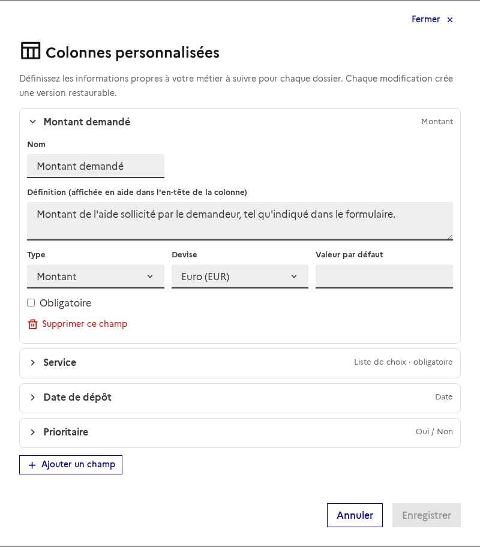

Réservé aux **administrateurs**, dans l'onglet d'une analyse. Chaque champ a un **nom**, une **définition** (affichée en aide dans l'en-tête, comme celle d'un label ou d'une entité), un **type** et des options :

| Type | Particularités |
| --- | --- |
| **Texte**, **Nombre**, **Date**, **Oui / Non** | Valeur par défaut facultative. |
| **Montant** | Positif, avec une devise (euro, dollar, livre). |
| **Liste de choix** | Un choix par ligne ; la valeur doit appartenir à la liste. |

« **Obligatoire** » interdit une valeur vide. **Supprimer un champ** se défait avant l'enregistrement, et on choisit explicitement de **conserver** les valeurs déjà saisies (récupérables si le champ revient) ou de les **supprimer définitivement**.

### Historique et restauration

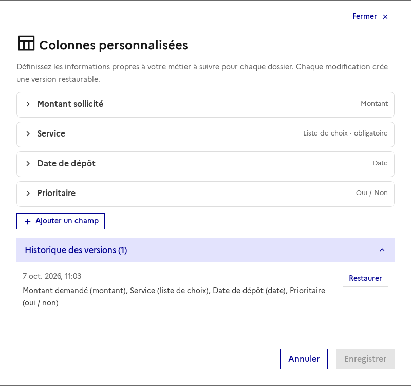

Comme tout champ éditable d'une analyse, la définition des champs est **versionnée** : chaque enregistrement conserve l'état précédent, et « **Restaurer** » en ajoute une version (rien n'est écrasé).

### Éditer une valeur

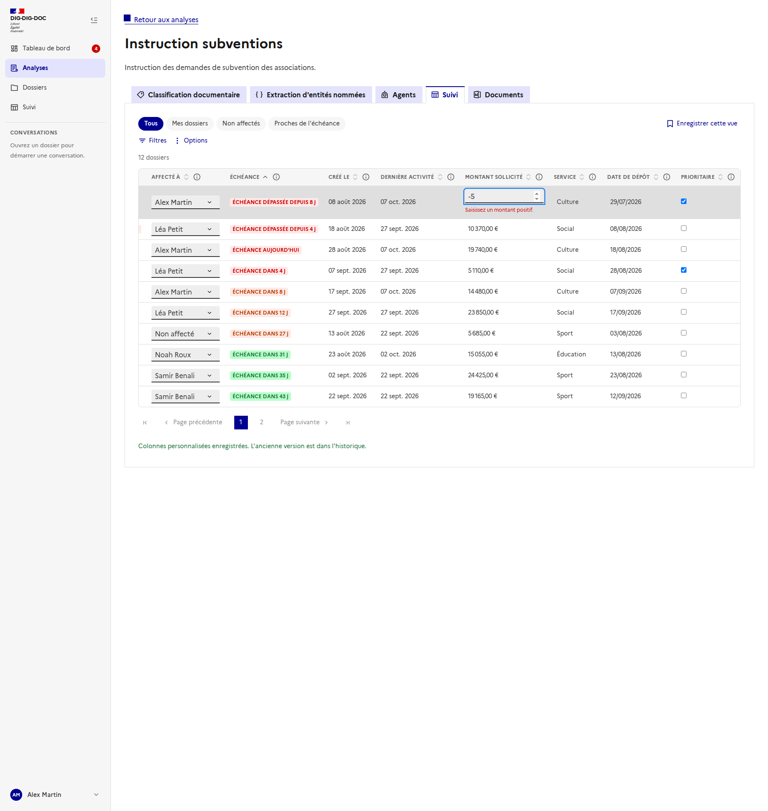

Un clic sur une valeur l'édite sur place : **Entrée** ou la sortie du champ valide, **Échap** annule. La saisie est contrôlée selon le type ; en cas d'erreur (ici, un montant négatif), la cellule reste en édition avec son message. Les cases « oui/non » s'enregistrent au clic. Chaque modification est notée comme tracée dans l'historique du dossier.

## La vue transversale

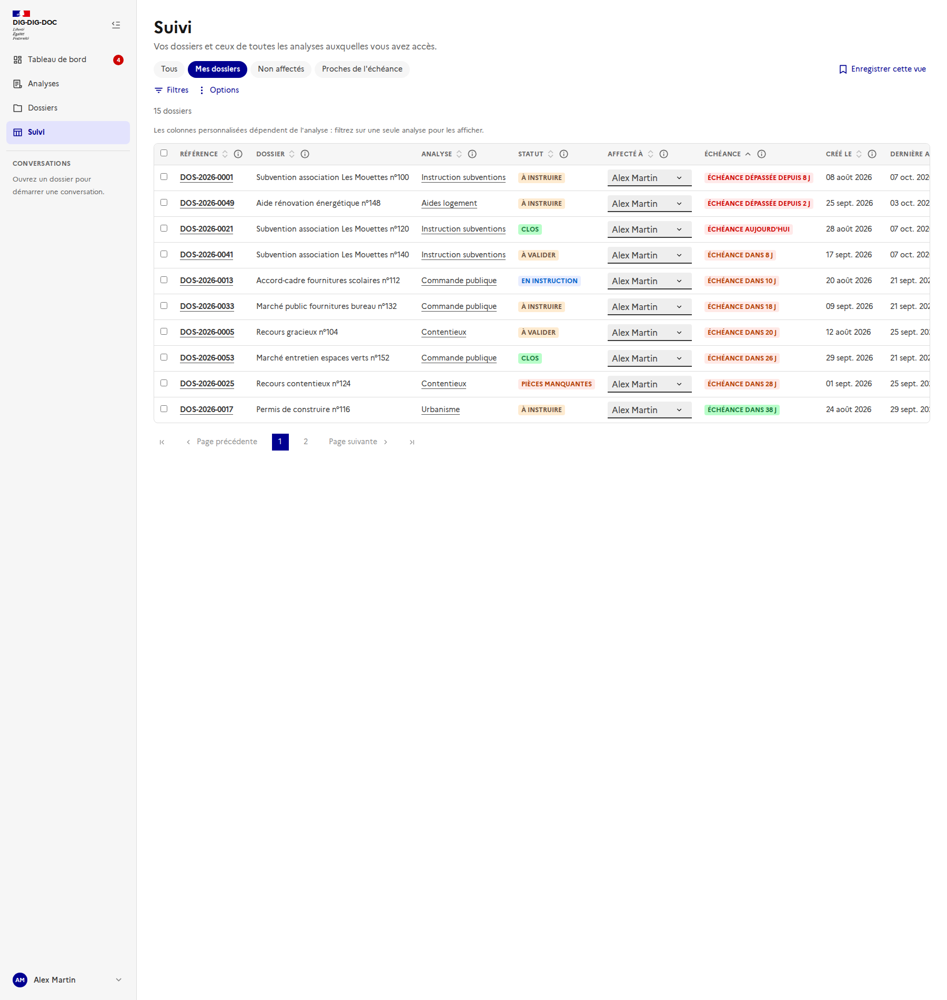

La page **Suivi** de la barre latérale reprend le même tableau sur **toutes les analyses accessibles**, ouverte sur **« Mes dossiers »**.

- Une colonne **Analyse** et un filtre **Analyse** (une ou plusieurs analyses) s'ajoutent.
- **Statuts** : chaque analyse a les siens ; tant que plusieurs analyses sont concernées, le filtre propose des **catégories communes** (« À démarrer », « En cours », « Clos »). Avec une seule analyse filtrée, il propose ses statuts exacts.
- **Colonnes personnalisées** : définies par analyse, elles n'apparaissent que lorsqu'**une seule analyse** est filtrée ; sinon une phrase l'explique.

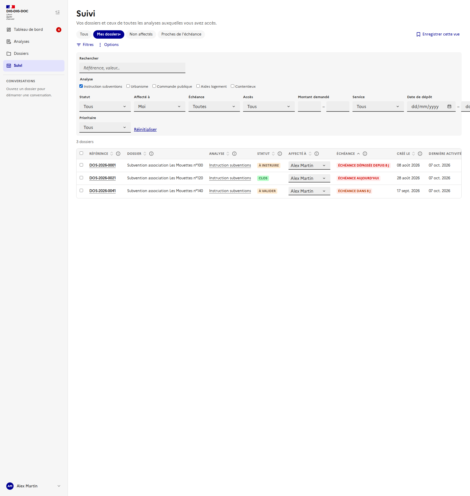

### Liens profonds

Les filtres se lisent dans l'URL, ce qui permet au tableau de bord et aux notifications d'y renvoyer :

| Paramètre | Effet |
| --- | --- |
| `assignee=me` ou `assignee=none` ou `assignee=<id>` | Mes dossiers, non affectés, ou une personne. |
| `status=<id>` | Un statut précis. |
| `due=overdue`, `7`, `30` ou `none` | Échéance dépassée, dans 7 jours, dans 30 jours ou sans échéance. |
| `analyse=<id>,<id>` | Une ou plusieurs analyses (vue transversale). |

## Choix et limites

- **Données simulées** (`src/mocks/dossiers.ts`), communes au tableau de bord : une affectation faite ici se retrouve dans le tableau de bord. Rien n'est enregistré au rechargement de la page, sauf les **vues** et les **colonnes** choisies, gardées dans le navigateur.
- Les analyses simulées (Instruction subventions, Urbanisme…) ne correspondent pas à celles de l'application : l'onglet « Suivi » d'une analyse réelle prend l'analyse simulée **du même nom**, sinon la première. Les liens « Analyse » du tableau deviendront valides avec l'API.
- Toutes les analyses simulées **partagent les mêmes statuts** ; dans l'application réelle ils sont propres à chaque analyse ([#168](https://github.com/IA-Generative/dig-dig-doc/issues/168)).
- L'export CSV et les droits de lecture des valeurs personnalisées restent à confirmer (données d'usagers, [#144](https://github.com/IA-Generative/dig-dig-doc/issues/144)).
- Les captures sont prises par `frontend/scripts/doc-screenshots.mjs` avec l'API interceptée.
