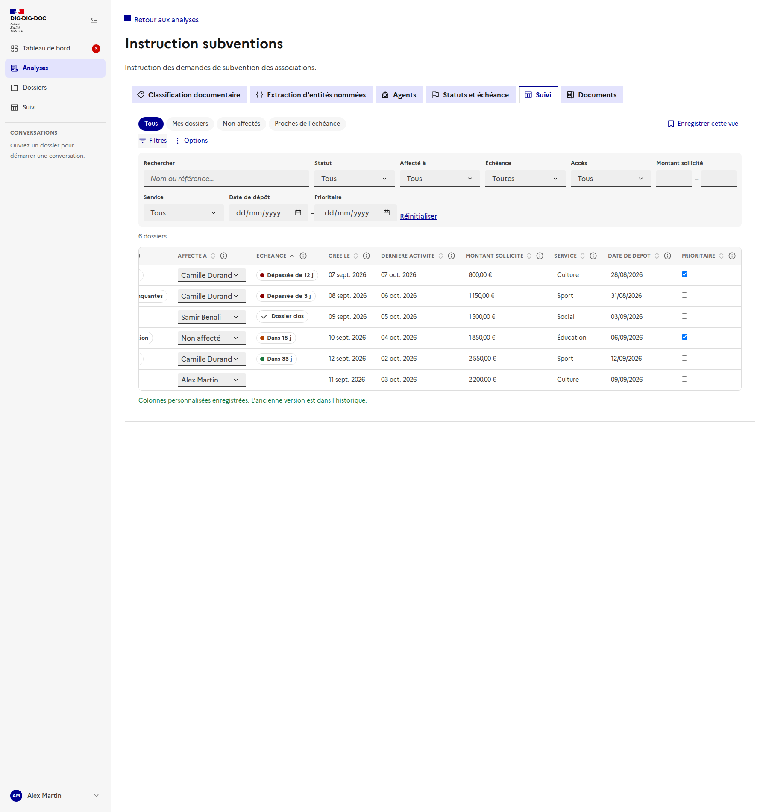
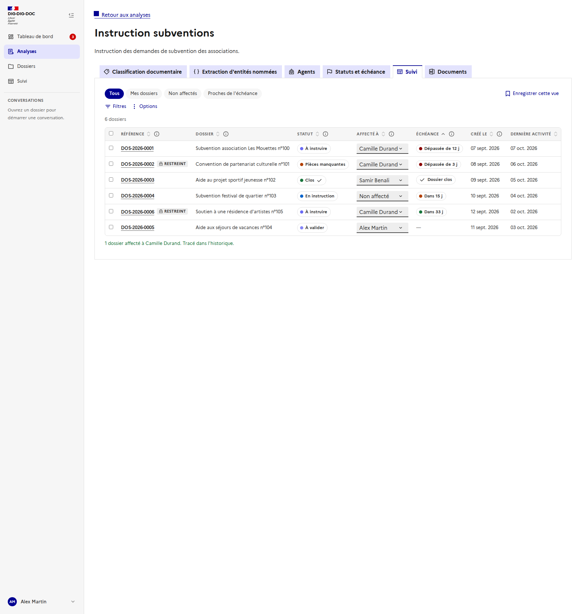

# Tableau de suivi des dossiers

Issues : [#173](https://github.com/IA-Generative/mille-feuille/issues/173) (tableau, par analyse) et [#186](https://github.com/IA-Generative/mille-feuille/issues/186) (vue transversale), parent [#167](https://github.com/IA-Generative/mille-feuille/issues/167). Le [tableau de bord](../tableau-de-bord/README.md) y renvoie par des liens filtrés ; les règles d'accès sont dans [accès aux dossiers par groupe](../acces-aux-dossiers/README.md).

Un **tableau de pilotage des dossiers** : qui s'en occupe, où ils en sont, quelle est leur échéance, plus des **colonnes personnalisées** définies par l'administrateur de l'analyse. Il existe **à deux niveaux** avec le même composant : dans chaque analyse, et en **vue transversale** sur toutes les analyses accessibles.

> **Branché sur l'API** : la liste, les filtres, la recherche, le tri, la pagination, l'échéance, l'affectation, les **colonnes personnalisées** et l'**accès par groupe** viennent du serveur ([tableau de suivi](../../backend/tableau-de-suivi.md), [affectation](../../backend/affectation-des-dossiers.md), [colonnes personnalisées](../../backend/colonnes-personnalisees.md), [accès](../acces-aux-dossiers/README.md)). Voir « Choix et limites ».

## Y accéder

- **Par analyse** : onglet **« Suivi »** d'une analyse (`/analyses/<id>/suivi`), entre « Agents » et « Documents ».
- **Transversal** : entrée **« Suivi »** de la barre latérale (`/suivi`).

## Le tableau

Une ligne par dossier : **référence** (« DOS-2026-0042 », lien vers le dossier), **nom**, statut, **affecté à**, **échéance**, dates de création et de dernière activité.

- **Tri** : un clic sur un en-tête trie la colonne (le sens est annoncé aux lecteurs d'écran).
- **Pagination** : 10 dossiers par page, avec le total au-dessus du tableau. Le tri, les filtres et la pagination sont faits **côté serveur**.
- **Échéance** : badge coloré **et libellé** (« Dans 8 j », « Dépassée de 4 j », « Dossier clos ») ; le **niveau et la couleur sont calculés par le serveur** selon les seuils de l'analyse de la ligne ([échéance](../echeance-du-dossier/README.md)), et la couleur n'est jamais le seul signal.
- Une erreur de chargement s'affiche avec un bouton **Réessayer**.
- **Définition d'une colonne** : le bouton « i » de chaque en-tête ouvre une bulle avec sa **définition**.

### Vues

Les pastilles du haut sont des **vues** : *Tous*, *Mes dossiers*, *Non affectés*, *Proches de l'échéance* (7 jours ou moins). Un point apparaît sur la vue active dès qu'on a modifié ses filtres ou son tri. « **Enregistrer cette vue** » en crée une, à son nom (filtres et tri) ; elle se supprime depuis sa pastille. Les vues enregistrées sont **personnelles**.

## Filtrer

« Filtres » déplie : la **recherche** (nom ou référence), le **statut**, **affecté à** (moi, non affectés, une personne de l'annuaire), l'**échéance** (dépassées, ≤ 7 j, ≤ 30 j, sans échéance ; dossiers non clos) et l'**accès**. « Réinitialiser » efface tout.

Quand **une seule analyse** est concernée (l'onglet « Suivi » d'une analyse, ou la vue transversale filtrée sur une analyse), un filtre par **colonne personnalisée** s'ajoute, adapté à son type : texte, liste, oui/non, plage pour un nombre, un montant ou une date. La **recherche** cherche aussi dans les valeurs des colonnes.

## Affecter

Dans la colonne « Affecté à », le menu de chaque ligne réaffecte directement le dossier. Pour une **affectation en lot**, on coche des lignes (la case de l'en-tête sélectionne la page) : une barre apparaît.

- **Affecter à…** puis « Affecter », ou « **Retirer l'affectation** ». Les personnes proposées sont celles de l'**annuaire** : quiconque s'est déjà connecté à l'application.
- L'affectation en lot est **une seule transaction** côté serveur : tout ou rien.

- Chaque affectation est confirmée dans une zone annoncée (« 2 dossiers affectés à Camille Durand. Tracé dans l'historique. ») ; si la personne était déjà responsable, le message le dit. L'événement figure dans l'[historique du dossier](../historique-du-dossier/README.md).

## Options

Le menu **Options** regroupe : **Colonnes**, **Champs personnalisés** (administrateurs, dans l'onglet d'une analyse) et **Exporter en CSV**.

### Colonnes

On coche les colonnes à afficher et on les **ordonne** avec les flèches (utilisables au clavier) ; chacune rappelle sa définition. « Rétablir par défaut » revient au choix initial, et il faut garder au moins une colonne. Ce choix est **personnel** et distinct pour chaque analyse et pour la vue transversale.

### Exporter en CSV

L'export reprend **la vue courante** : filtres, tri et colonnes visibles (séparateur « ; » et encodage lisible dans Excel). Il est limité à **2 000 lignes** ; au-delà, l'interface le dit et invite à affiner les filtres.

## Les colonnes personnalisées

Réservé aux **administrateurs**, dans l'onglet d'une analyse (Options, « Champs personnalisés »). Chaque champ a un **nom**, une **définition** (affichée en aide dans l'en-tête, comme celle d'un label ou d'une entité), un **type** et des options. Jusqu'à **20 champs** par analyse.

| Type | Particularités |
| --- | --- |
| **Texte**, **Nombre**, **Date**, **Oui / Non** | Valeur par défaut facultative. |
| **Montant** | Positif, avec une devise (euro, dollar, livre). |
| **Liste de choix** | Un choix par ligne ; la valeur doit appartenir à la liste. |

- « **Obligatoire** » interdit une valeur vide. La **valeur par défaut** est donnée aux **nouveaux** dossiers (pas aux dossiers existants).
- Le serveur **valide la définition** : nom unique, au moins un choix pour une liste, valeur par défaut cohérente avec le type ; son message s'affiche sous la liste.
- **Supprimer un champ** se défait avant l'enregistrement, et on choisit explicitement de **conserver** les valeurs déjà saisies (récupérables si on restaure une version qui contient le champ) ou de les **supprimer définitivement**.
- **Changer le type d'un champ** supprime les valeurs déjà saisies dans ce champ : un avertissement le dit avant l'enregistrement.

### Historique et restauration

Comme tout champ éditable d'une analyse, la définition des champs est **versionnée** : chaque enregistrement conserve l'état précédent, et « **Restaurer** » en ajoute une version (rien n'est écrasé). Les valeurs ne sont pas restaurées : elles restent celles des dossiers.

### Éditer une valeur

Un clic sur une valeur l'édite sur place : **Entrée** ou la sortie du champ valide, **Échap** annule. La saisie est **contrôlée par le serveur** selon le type ; en cas d'erreur (ici, un montant négatif), la cellule reste en édition avec le message du serveur. Les cases « oui/non » s'enregistrent au clic. Chaque modification est tracée dans l'[historique du dossier](../historique-du-dossier/README.md) (« Colonne modifiée », ancienne → nouvelle valeur, auteur).

Toute personne qui **voit le dossier** peut saisir ses valeurs ; seuls les administrateurs définissent les colonnes.

## La vue transversale

La page **Suivi** de la barre latérale reprend le même tableau sur **toutes les analyses accessibles**, ouverte sur **« Mes dossiers »**.

- Une colonne **Analyse** et un filtre **Analyse** (une ou plusieurs analyses) s'ajoutent.
- **Statuts** : chaque analyse a les siens ; tant que plusieurs analyses sont concernées, le filtre propose des **catégories communes** (« À démarrer », « En cours », « Clos »). Avec une seule analyse filtrée, il propose ses statuts exacts.
- **Colonnes personnalisées** : définies par analyse, elles n'apparaissent que lorsqu'**une seule analyse** est filtrée ; sinon une phrase l'explique, et le serveur refuse leurs filtres et leur tri.

### Liens profonds

Les filtres se lisent dans l'URL, ce qui permet au tableau de bord et aux notifications d'y renvoyer :

| Paramètre | Effet |
| --- | --- |
| `assignee=me` ou `assignee=none` ou `assignee=<id>` | Mes dossiers, non affectés, ou une personne. |
| `status=<id>` | Un statut précis (l'identifiant d'un statut de l'analyse ; les liens encore simulés du tableau de bord sont ignorés). |
| `due=overdue`, `7`, `30` ou `none` | Échéance dépassée, dans 7 jours, dans 30 jours ou sans échéance. |
| `analyse=<id>,<id>` | Une ou plusieurs analyses (vue transversale). |

## Choix et limites

- **Branché sur l'API** : liste, filtres, recherche, tri, pagination, échéance, affectation, colonnes personnalisées (définitions, valeurs, filtres, tri), accès par groupe. Le **tableau de bord** utilise la même route de lecture pour ses liens.
- **Vues enregistrées et colonnes choisies** : gardées dans le navigateur, propres à l'utilisateur et à la portée (une analyse, ou la vue transversale). Leur persistance côté serveur reste à faire.
- **Valeurs personnalisées** : internes, non visibles de l'usager. Leur modification est tracée dans le journal du dossier avec l'ancienne et la nouvelle valeur.
- **Export CSV** : il reprend la vue courante, colonnes personnalisées comprises, jusqu'à 2 000 lignes. Les droits de lecture des valeurs et l'export des données d'usagers restent à confirmer ([#144](https://github.com/IA-Generative/mille-feuille/issues/144)).
- **Pas encore** : le pré-remplissage des valeurs par l'IA à partir de l'analyse du dossier (suite possible).
- Pas de test automatisé côté interface ([#213](https://github.com/IA-Generative/mille-feuille/issues/213)) : l'écran est vérifié par ces captures, prises par `frontend/scripts/doc-screenshots.mjs` avec l'API interceptée (`node scripts/doc-screenshots.mjs <url> tracking`).
